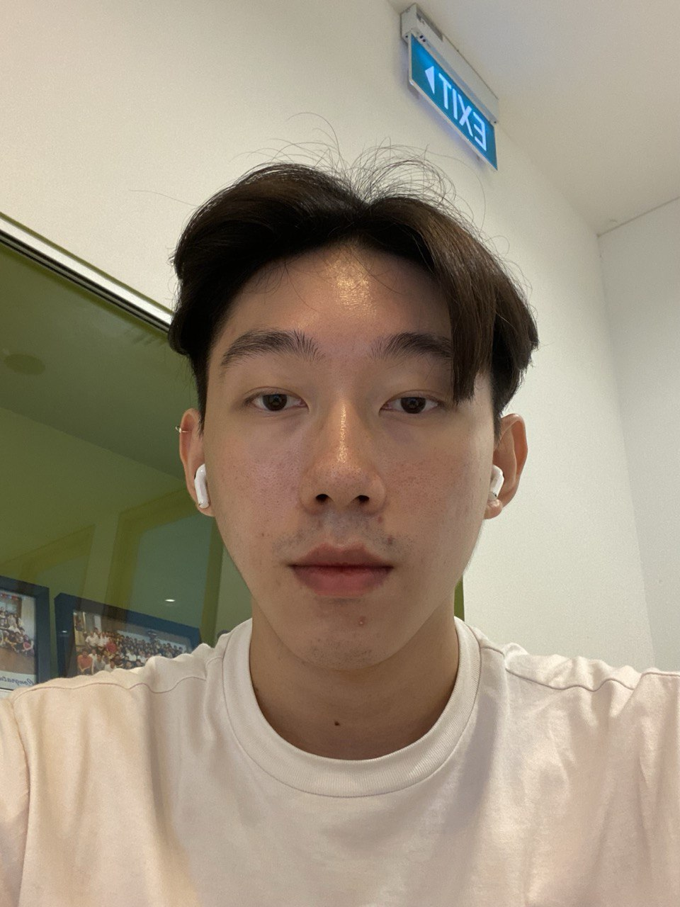
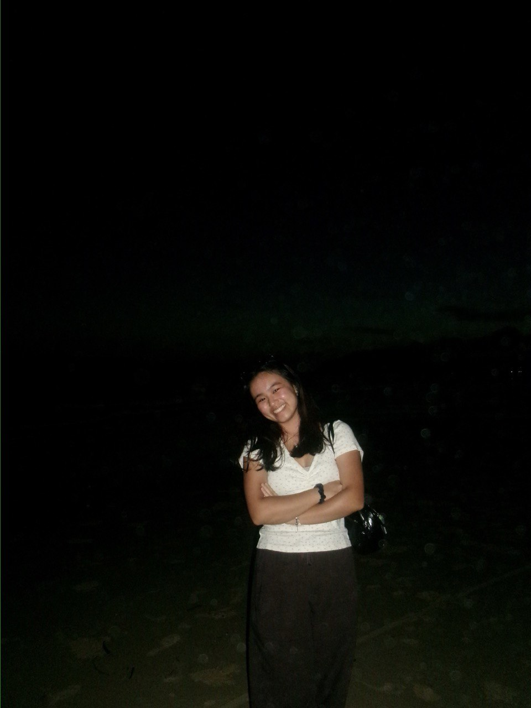
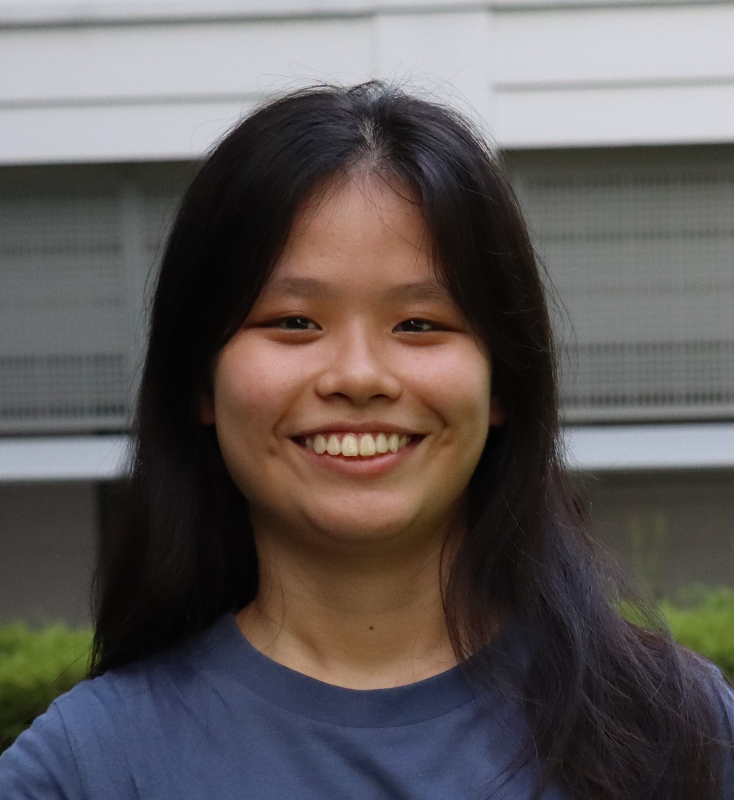
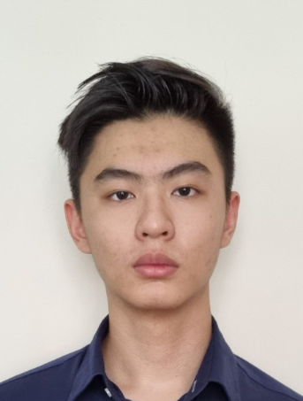

# About Us

We are a team based in the [School of Computing, National University of Singapore](http://www.comp.nus.edu.sg).

You can reach us at the email `seer[at]comp.nus.edu.sg`

## Project team 15a-4 "homey"

### Zhe Quan

[[homepage](http://www.comp.nus.edu.sg/~damithch)]

[[github](https://github.com/zhequan00)]
[[portfolio](team/zhequan.md)]

* Role: Project Advisor

### Koh Zhiyu

[[github](http://github.com/zhiyu05)]
[[portfolio](team/zhiyu.md)]

* Role: Team Lead
* Responsibilities: UI

### Johnny Doe

[[github](http://github.com/johndoe)] [[portfolio](team/johndoe)]

* Role: Developer
* Responsibilities: Data

### Yun Qi

[[github](http://github.com/t-yunqi)]
[[portfolio](team/yunqi.md)]

* Role: Developer
* Responsibilities: Dev Ops + Threading

### Heng Jia Yuan

[[github](http://github.com/jyheng02)]
[[portfolio](team/jiayuan.md)]

* Role: Developer
* Responsibilities: UI

### Kimberlee Soo

[[github](http://github.com/Kimberlee97)]
[[portfolio](team/kimberlee.md)]

* Role: Developer
* Responsibilities: UI
