# Homey User Guide

Homey is a **desktop app for property agents** to manage clients, meetings, and transactions - all in one place.

It combines the **speed of a Command Line Interface (CLI)** with the **simplicity of a Graphical User Interface (GUI)**, so you can work quickly while staying organised.

With Homey, you can:
* Categorise contacts as *clients* or *vendors*
* Track deal progress through *transaction stages*
* Schedule and view *meetings* directly
* Hide contacts by *archiving* to keep your list organised without losing information

Whether you're closing deals or managing follow-ups, Homey helps you stay on top of your work - faster and smarter.<br>

If you're a new user, start with the Quick Start section to set up Homey.
If you're already familiar, jump directly to the section relevant to your needs.<br>

<style>
@media screen {
  .page-nav-print {
    display: block !important;
  }
}
<style>


img {
  display: block;
  margin: 1.2em auto;      
  width: 65%;              
  height: auto;           
  border-radius: 4px;      
}

/* Caption styling */
p img + p, div img + p {
  text-align: center;
  font-style: italic;
  margin-top: 4px;
  color: #444;
}
</style>

<!-- * Table of Contents -->
<page-nav-print />
&nbsp;

&nbsp;

--------------------------------------------------------------------------------------------------------------------
&nbsp;

&nbsp;

## Quick start

1. To ensure you have Java `17` or above installed in your Computer:<br>
   * Search for Command Prompt in the Start Menu (if you are using Mac, open terminal by using Spotlight Search (Command + Space bar), then type "Terminal").
&nbsp;
<div style="display: inline-block; text-align: center;">
  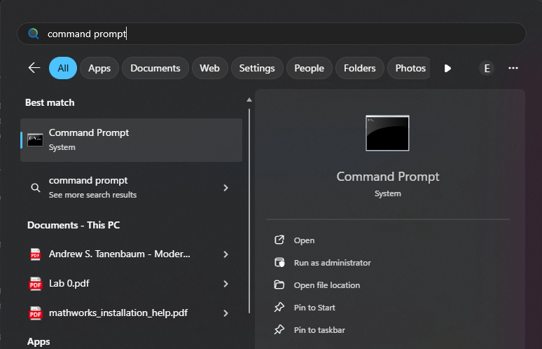
  <p style="text-align: center; margin-top: 4px;"><i>Search for command prompt in Start Menu</i></p>
</div>

   * Type `java -version` and press Enter. You should see an output similar to below.

   ```
    java version "17.0.16" 2025-07-15 LTS
    Java(TM) SE Runtime Environment (build 17.0.16+12-LTS-247)
    Java HotSpot(TM) 64-Bit Server VM (build 17.0.16+12-LTS-247, mixed mode, sharing)
   ```
  * Verify that the terminal displays `java version "17"` or higher (highlighted line in screenshot above).<br>
  * if Java version displayed is not Java `17` or higher:
    * **Windows users:** Ensure you have the precise JDK version prescribed [here](https://se-education.org/guides/tutorials/javaInstallationWindows.html).
    * **Mac users:** Ensure you have the precise JDK version prescribed [here](https://se-education.org/guides/tutorials/javaInstallationMac.html).

2. Download the latest `.jar` file from [here](https://github.com/AY2526S1-CS2103T-F15A-4/tp/releases/).

3. Copy the file to the folder you want to use as the _home folder_ for Homey.

4. Open the command terminal (as in Step 1), and change directory using the command `cd` into the folder you put the jar file in.<br>
   <box type="tip" seamless>
   **Tip:**<br>
   If your home folder is in your desktop, make sure you change directory to your desktop first as shown in the screenshot.<br>
   For example, we change directory to the `Desktop` first, before changing it to the folder `your_home_folder_name` where our jar file is in.
   </box>
&nbsp;
<div style="display: inline-block; text-align: center;">
  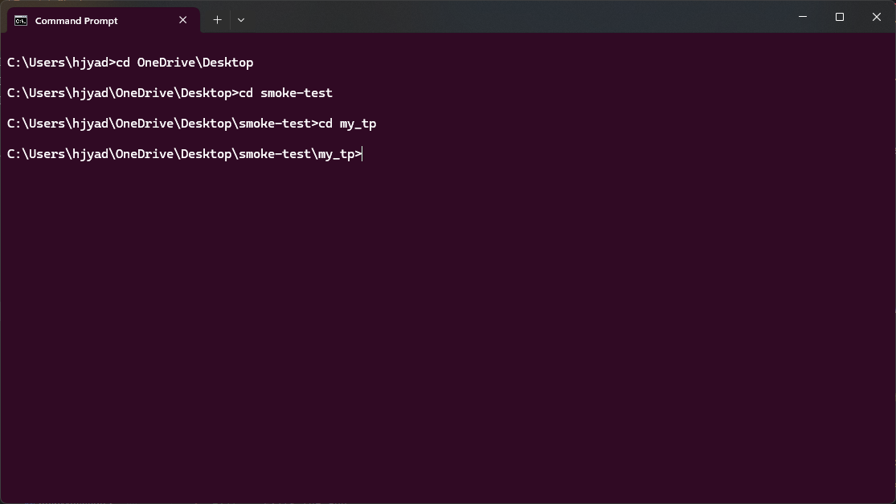
  <p style="text-align: center; margin-top: 4px;"><i>Changing directory to home folder</i></p>
</div>

5. Use the `java -jar homey.jar` command and press Enter to run the application.<br>
&nbsp;
<div style="display: inline-block; text-align: center;">
  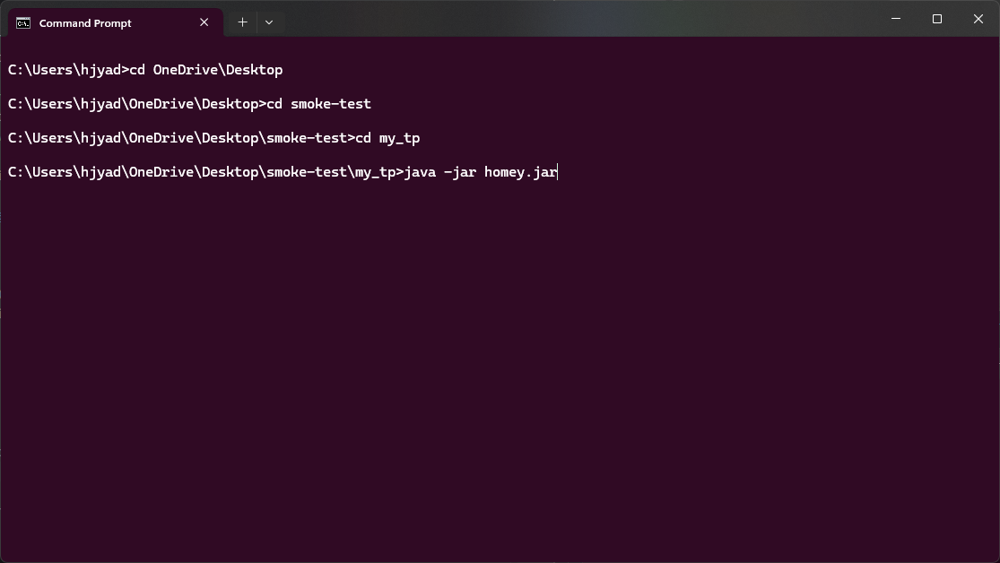
  <p style="text-align: center; margin-top: 4px;"><i>Command to run the app</i></p>
</div>

6. A GUI similar to the below should appear in a few seconds. Note how the app contains some sample data.<br>
&nbsp;
<div style="display: inline-block; text-align: center;">
  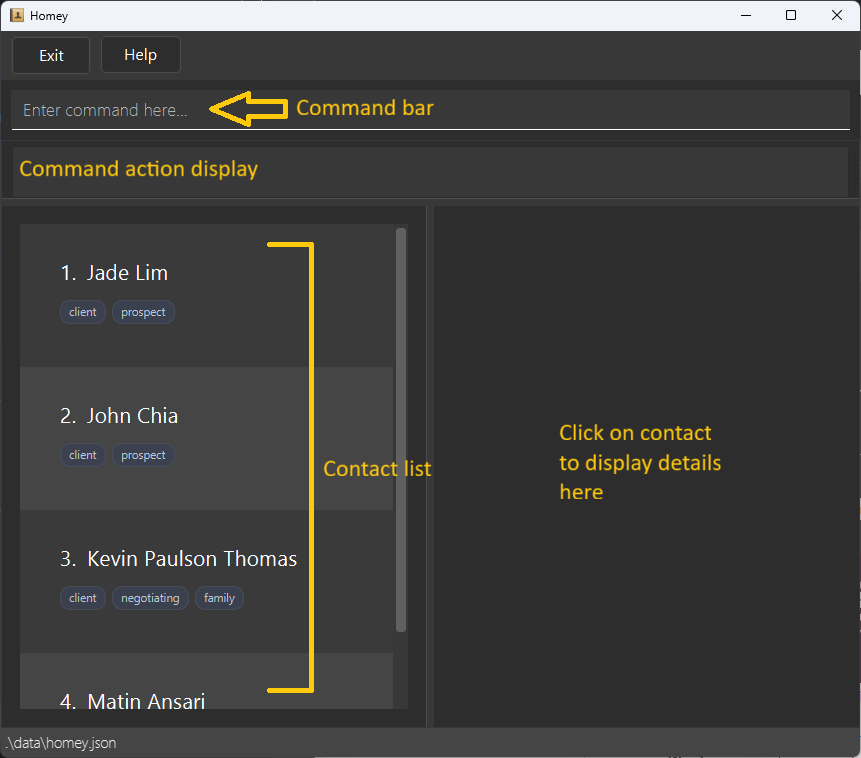
  <p style="text-align: center; margin-top: 4px;"><i>App launch landing page</i></p>
</div>

7. Type a command in the command box and press Enter to execute it. e.g. typing **`help`** and pressing Enter will open the User Guide in your web browser (if the browser can’t be opened, a Help window will appear instead).<br>
   Some example commands you can try:

   * `list` : Lists all contacts.

   * `add n/John Doe p/98765432 e/johnd@example.com a/John street, block 123, #01-01 s/prospect` : Adds a contact named `John Doe` to Homey.

   * `delete 3` : Deletes the 3rd contact shown in the current list.

   * `clear` : Deletes all contacts.

   * `exit` : Exits the app.

8. Refer to the [Features](#features) below for details of each command.
&nbsp;

&nbsp;

--------------------------------------------------------------------------------------------------------------------
&nbsp;

&nbsp;

## Glossary
Before you start using Homey’s commands, here’s a list of key terms you’ll see throughout this guide.
This glossary helps you understand the words used in commands, so you can follow the examples confidently.

| **Term** | **Meaning**                                                                                                                                                                                      |
|-----------|--------------------------------------------------------------------------------------------------------------------------------------------------------------------------------------------------|
| **Command** | An instruction you type in Homey to perform an action (e.g. `add`, `edit`, `find`).                                                                                                              |
| **Parameter** | The information you give after a command (e.g. in `add n/John`, `John` is the parameter).                                                                                                        |
| **Prefix** | A short label before a slash that identifies a type of information (e.g. `n/` for name, `p/` for phone). Must be separated from other text by a space (e.g. `edit 1 n/John`, not `edit 1n/John`) |
| **Placeholder** | A word written in CAPITAL LETTERS that shows the kind of information you should type (e.g. `NAME` in `n/NAME` means you should enter a real name).                                               |
| **Index** | The number beside each contact in the list (e.g. `2` refers to the second contact).                                                                                                              |
| **Optional field** | Extra details you may include, shown in brackets `[ ]` (e.g. `[t/TAG]`).                                                                                                                         |
| **Required field** | Details you must include for the command to work (e.g. `n/NAME` in `add`).                                                                                                                       |
| **Tag** | A label to group contacts (e.g. `t/friend`, `t/investor`).                                                                                                                                       |
| **Transaction stage** | The deal status — `prospect`, `negotiating`, or `closed`.                                                                                                                                        |
| **Relation** | Whether the contact is a `client` (buyer) or `vendor` (seller).                                                                                                                                  |
| **Meeting** | A scheduled appointment or viewing linked to a contact.                                                                                                                                          |
| **Remark** | A short note about the contact (e.g. “Prefers text messages”).                                                                                                                                   |
| **Archive** | Hides a contact without deleting it.                                                                                                                                                             |
| **Unarchive** | Restores an archived contact to the active list.                                                                                                                                                 |
| **List** | Shows your saved contacts (e.g. `list`, `list meeting`, `list archive`).                                                                                                                         |
| **Duplicate Contacts** | A contact that has the same name (case-sensitive) as an existing contact, even if other details differ.                                                                                          |

--------------------------------------------------------------------------------------------------------------------
&nbsp;

&nbsp;

## Features

<box type="info" seamless>

**How to Use the Command Formats:**

* Words in `CAPITAL LETTERS` are parameters.
  * These are the parts you replace with your own information. 
  * Example: `add n/NAME` means `NAME` is a placeholder for you to type the real name.


* Items in square brackets [] are optional.
  * This means you can include them or leave them out. 
  * Example: `n/NAME [t/TAG]` means you can type `n/John Doe t/friend` or `n/John Doe`.


* Items with `…`​ can appear many times.
  * If something ends with three dots `…​`, you can use it as many times as you want — even zero.
  * Example `[t/TAG]…​` means you can type nothing, one tag, or several. 


* You can mix the order — for fields (prefix and parameter pairs) only.
  * Always type the command name (e.g. `find`, `add`, `edit`) and `INDEX` (if needed) first. 
  * You can rearrange the fields (e.g. `n/NAME`, `t/TAG`) in any order you like. 
  * Example: `add n/NAME p/PHONE_NUMBER` works the same as `add p/PHONE_NUMBER n/NAME`.


* Extra inputs for simple commands are ignored.
  * Commands like `exit` and `clear` do not take extra information. 
  * Example: `exit 123` works the same as `exit`.


* `help` accepts a topic for quick navigation.
  * Example:`help add` opens that section of the User Guide directly.


* When copying commands from this guide, ensure no spaces disappear at line breaks.
</box>
&nbsp;

&nbsp;

### Viewing Help

Homey provides a built-in help feature to guide you through all available commands.  
If you're unsure about what to do, use the `help` command to open the User Guide directly in your browser.

**Generic behaviour:**
- **Online access:** When you enter a `help [TOPIC]` command (e.g. `help add`), the browser automatically opens the relevant section of the User Guide.
&nbsp;
<div style="display: inline-block; text-align: center;">
  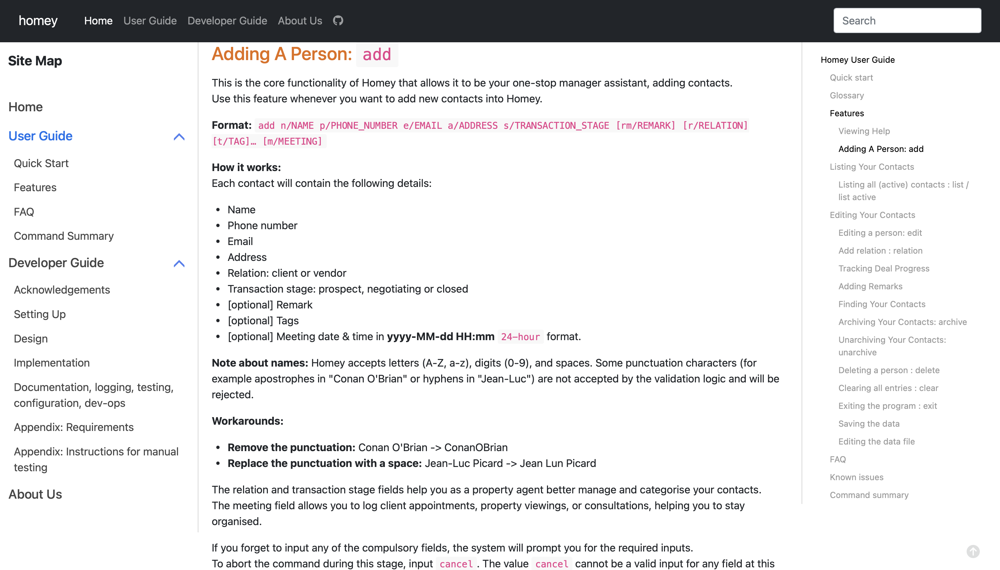
  <p style="text-align: center; margin-top: 4px;"><i>User Guide opens to "Adding Contacts" section</i></p>
</div>

- **Offline or blocked access:**  
  If the browser cannot be opened (e.g. blocked by the environment) or you do not have internet access, a Help window will appear instead.  
  You can also open this window manually using the `help offline` command.  
  This window provides a summary of all available commands and usage examples.  
&nbsp;
<div style="display: inline-block; text-align: center;">
  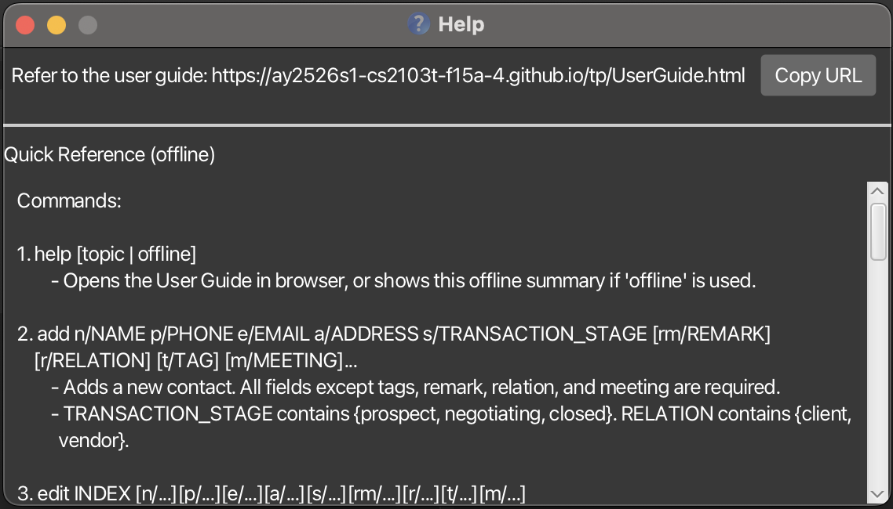
  <p style="text-align: center; margin-top: 4px;"><i>Offline Help window</i></p>
</div>

#### Help by topic: `help [TOPIC]`

**Format:** `help [TOPIC]`

**How it works:**
* `TOPIC` is optional and deep-links to a specific section of this guide.
* Topic matching is case-insensitive and ignores surrounding spaces.
* If the browser cannot be opened (e.g. blocked by the environment), a Help window will appear instead so you can copy the link manually.

**Supported topics:**  
`add`, `edit`, `delete`, `find`, `list`, `help`, `find a/`, `find t/`, `find r/`, `find s/`,  
`relation`, `transaction`, `archive`, `unarchive`, `remark`, `list meeting`, `list archived`, `list active`, `clear`, and `exit`.

**Examples:**
* `help` → Opens the User Guide home.
* `help add` → Opens the “Adding a Person” section.
* `help edit` → Opens the “Editing Your Contacts” section.

#### Help offline: `help offline`

**Format:** `help offline`

**How it works:**  
If you do not have internet access, you can manually open the Help window using the `help offline` command.  
This window provides a summary of all available commands and usage examples, allowing you to continue using Homey seamlessly while offline.

**Example:**
* `help offline` → Opens the offline Help window showing command summaries.
&nbsp;

&nbsp;

### Adding A Contact: `add`

This is the core functionality of Homey that allows it to be your one-stop manager assistant, adding contacts.  
Use this feature whenever you want to add new contacts into Homey.

**Format:** `add n/NAME p/PHONE_NUMBER e/EMAIL a/ADDRESS s/TRANSACTION_STAGE [rm/REMARK] [r/RELATION] [t/TAG]…​ [m/MEETING]​`

**How it works:**  
Each contact will contain the following details:
* Name
* Phone number
* Email
* Address
* Relation: client or vendor
* Transaction stage: prospect, negotiating or closed
* [optional] Remark
* [optional] Tags
* [optional] Meeting date & time in **yyyy-MM-dd HH:mm** `24-hour` format.

**Note about names:** Homey accepts letters (A-Z, a-z), digits (0-9), and spaces. Some punctuation characters (for example apostrophes in "Conan O'Brian" or hyphens in "Jean-Luc") are not accepted by the validation logic and will be rejected.

**Workarounds:**
- **Remove the punctuation:** Conan O'Brian &rarr; ConanOBrian
- **Replace the punctuation with a space:** Jean-Luc Picard &rarr; Jean Lun Picard

The relation and transaction stage fields help you as a property agent better manage and categorise your contacts.  
The meeting field allows you to log client appointments, property viewings, or consultations, helping you to stay organised.

If you forget to input any of the compulsory fields, the system will prompt you for the required inputs.  
To abort the command during this stage, input `cancel`. The value `cancel` cannot be a valid input for any field at this stage.
 
Homey prevents adding duplicate contacts.

<box type="tip" seamless>

**Tips:** 
* A person can have any number of tags (including 0).
* The `s/TRANSACTION_STAGE` field only accepts the values `prospect`, `negotiating` or `closed`.
* The `r/RELATION` field only accepts the values `client` or `vendor`.
* The `m/MEETING` field is optional - use it to record a future meeting date and time (e.g. 2025-11-03 14:00).
* `MEETING` must follow **yyyy-MM-dd HH:mm** in (`24-hour` format).  
  Example: `2025-11-03 14:00` (3 Nov 2025, 2:00 PM)
* `MEETING` **can be in the past** but will be highlighted red in the contact card.
* Multiple contacts can have the same `MEETING`.
* The `r/RELATION` field is optional. The default relation for a new contact is client.
* The `rm/REMARK` field is optional - use it to add additional details regarding the person.
The remark field will be empty if no remark is given.
* Click on the contact after adding to reveal the contact card with full information on the right panel.

</box>

**Examples:**
* `add n/Jane Lim p/87438807 e/jade@ex.com a/Blk 30 s/prospect m/2025-11-07 14:00 rm/Likes nature`  
  &nbsp;
<div style="display: inline-block; text-align: center;">
  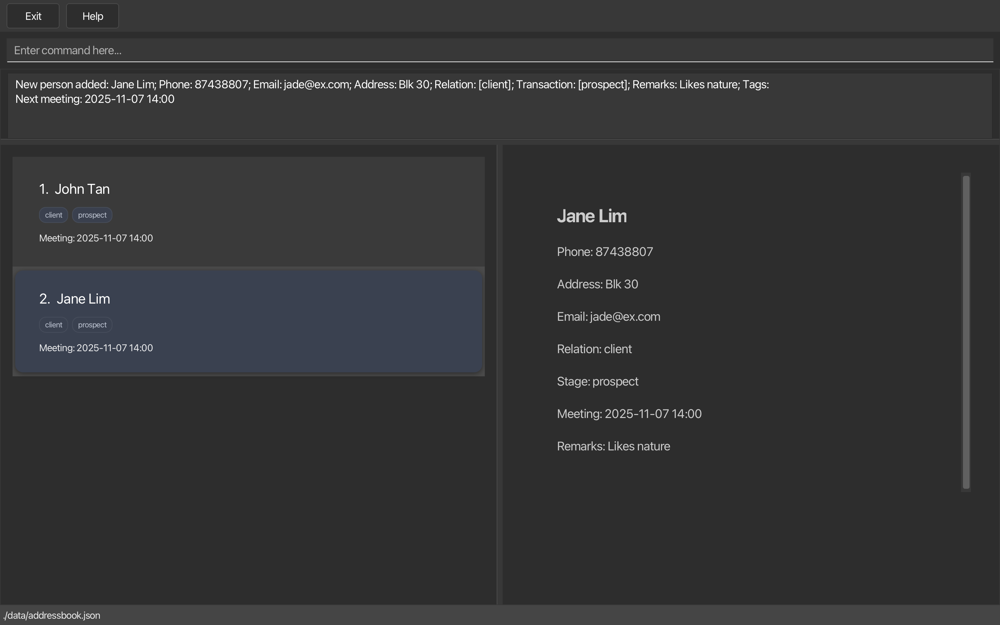
  <p style="text-align: center; margin-top: 4px;"><i>Added Jade Lim as contact</i></p>
</div>
&nbsp;

* `add n/John Doe p/98765432 e/johnd@example.com a/John street, block 123, #01-01 s/prospect`

* `add n/Betsy Crowe t/friend e/betsycrowe@example.com a/Newgate Prison p/1234567 s/negotiating t/criminal`

* `add n/Jeremiah Loh e/jloh@example.com a/Loh Street s/prospect`
  * Prompts for phone number input  
&nbsp;
<div style="display: inline-block; text-align: center;">
  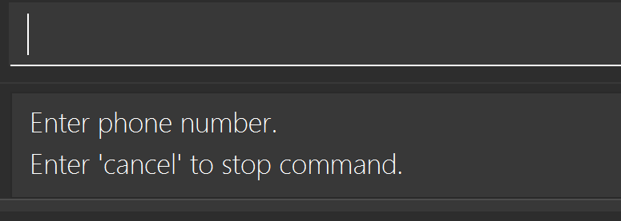
  <p style="text-align: center; margin-top: 4px;"><i>Prompt for phone number</i></p>
</div>
&nbsp;

* `add n/Kevin Tan p/87438807 e/kevin2@ex.com a/Blk 30 s/prospect m/2025-11-03 14:00`
  * Adds a new contact with a scheduled meeting on `3 Nov 2025, 2:00 PM`.
&nbsp;
<div style="display: inline-block; text-align: center;">
  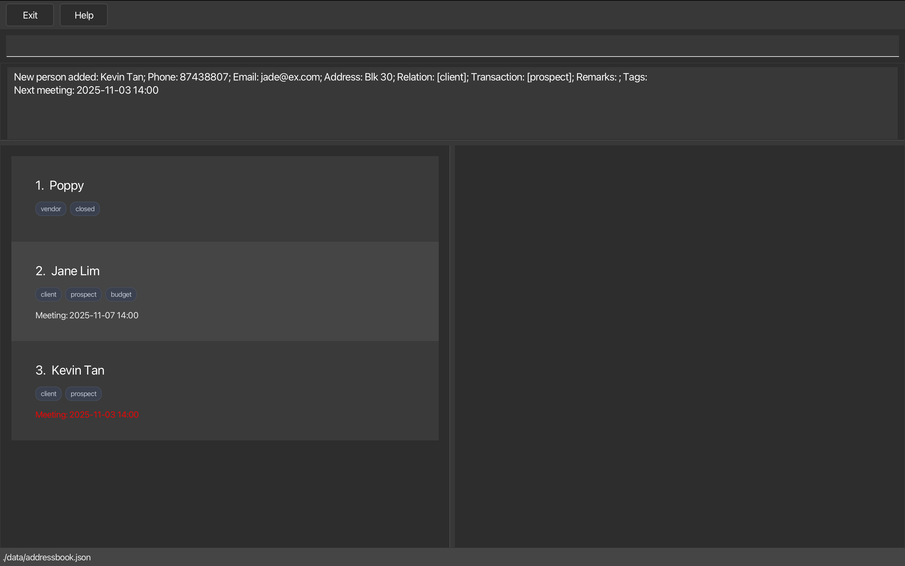
  <p style="text-align: center; margin-top: 4px;"><i>Added a contact Kevin with a scheduled meeting</i></p>
</div>
&nbsp;

&nbsp;

### Listing Your Contacts

Homey lets you view all current contacts and get a clear overview of who you’re working with.

**General list behaviour:**

* **Active list view:** By default, shows only contacts that are **not archived**.

* **Automatic view switching:** The displayed list automatically switches between active, archived, and meeting views depending on the command entered.

* **Reset view:** Clears any filters or search results (e.g., `find`, `list meeting`) and returns to the main contact list.

* **Instant update:** Any recent additions, edits, or deletions are immediately reflected in the displayed list.

* **Contact interaction:** Clicking on a contact opens its detailed information card on the right panel.

* **Case sensitivity:**
  * The base command `list` is case-sensitive. It must be typed exactly as `list`.
  * Parameters such as `active`, `archived`, `archive`, and `meeting` are case-insensitive (e.g., `list MEETING`, `list Archived`).

Displays all **active contacts** currently in Homey. Use this command when you want to return to the full contact view after performing filters or searches.

#### Listing all (active) contacts : `list` / `list active`

Displays all active (non-archived) contacts in Homey. 
Use this to return to the full contact view after performing filters, searches, or archiving.

Format: `list` / `list active`

**How it works:** 
* Displays only active contacts.
* Ignores extra spaces but not additional parameters unless specified in other commands.
* Contacts are displayed in the order they were added.
* Resets any previous filters or search results.

**Example:**

* `list active`
    &nbsp;
<div style="display: inline-block; text-align: center;">
  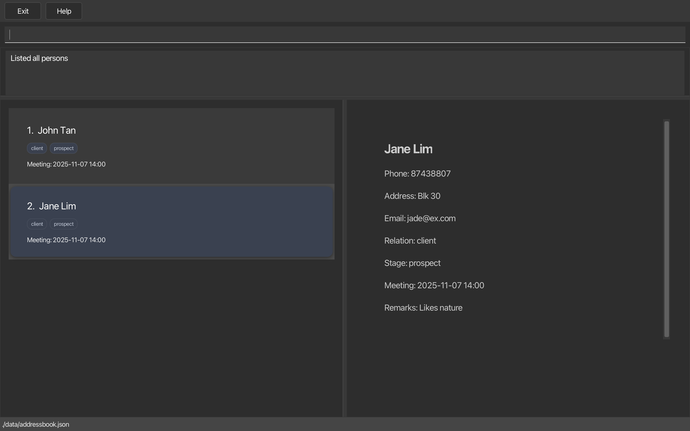
  <p style="text-align: center; margin-top: 4px;"><i>Shows the active list of contacts</i></p>
</div>
&nbsp;

#### Listing contacts by meeting date : `list meeting`

Displays all contacts with meetings, sorted by the **earliest meeting first**.

**Format:**  
`list meeting`

**How it works:**
* Displays only contacts with meetings, arranged from the nearest to the latest meeting.
* Contacts without meetings or that are archived will not be shown.
* If date and time are equal, contacts are sorted by name in `alphabetical order`.
* If no contacts have meetings, Homey displays message: `No contacts with meetings found.`

**Example:**
* `list meeting` 
  * Shows all contacts with meetings in `ascending order` of date and time.
&nbsp;
<div style="display: inline-block; text-align: center;">
  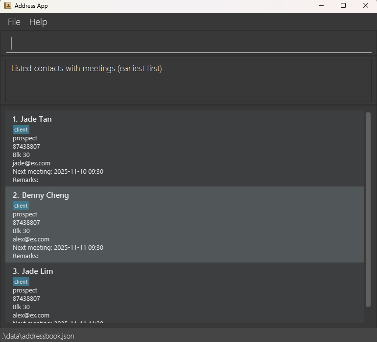
  <p style="text-align: center; margin-top: 4px;"><i>Listed contacts with meeting</i></p>
</div>

&nbsp;

#### Listing archived contacts: `list archived` / `list archive`

Displays all archived contacts. Use this command to view hidden contacts after archiving.

**Format:** `list archived` or `list archive`

**How it works:**
* Displays all archived contacts.
* You can use `unarchive INDEX` to move archived contacts back to the active list.

**Example:**
* `list archived` shows the archived contacts.
  &nbsp;
<div style="display: inline-block; text-align: center;">
  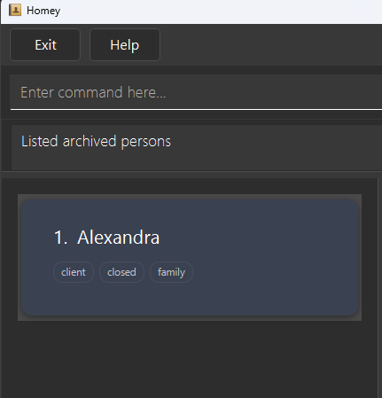
  <p style="text-align: center; margin-top: 4px;"><i>Listed archived contacts</i></p>
</div>
&nbsp;

&nbsp;

### Editing Your Contacts

Homey lets you update existing **active** contact details such as phone number, address, transaction stage, relation, remark, or meeting — all in one simple command.

**General editing behaviours:**

* **Automatic data validation:** Homey checks every edited field for valid format (e.g. phone, email, meeting date/time) before applying changes.

* **Partial updates:** You can edit one or multiple fields at once. Unspecified fields remain unchanged.

* **Conflict prevention:** Duplicate contacts are not allowed — Homey ensures edited entries do not match existing records.

#### Editing a contact: `edit`

Keeps your contact information up to date by editing an existing person’s details.

Format: `edit INDEX [n/NAME] [p/PHONE] [e/EMAIL] [a/ADDRESS] [r/RELATION] [s/TRANSACTION_STAGE] [rm/REMARK] [t/TAG]…​ [m/MEETING] ​`

* Edits the person at the specified `INDEX`. The index refers to the index number shown in the displayed person list. The index **must be a positive integer** 1, 2, 3, …​
* At least one of the optional fields must be provided.
* Existing values will be updated to the input values.
* `MEETING` must follow **yyyy-MM-dd HH:mm** (`24-hour` format).
* `MEETING` can be in the past but will be highlighted red in the contact card. 
* Multiple contacts can have the same `MEETING`.
* You can remove all the person’s tags by typing `t/` without
  specifying any tags after it.
* You can remove all the person’s remarks by typing `rm/` without
  specifying any remarks after it.
* You can remove the person's meeting by typing `m/` without 
  specifying any meetings after it.
* Click on the contact to reveal the contact card with full information on the right panel.

**Examples:**
* `edit 1 p/91234567 e/john@example.com`
  * Edits the phone number and email address of the `1st` person to be `91234567` and `john@example.com` respectively.
  &nbsp;
<div style="display: inline-block; text-align: center;">
  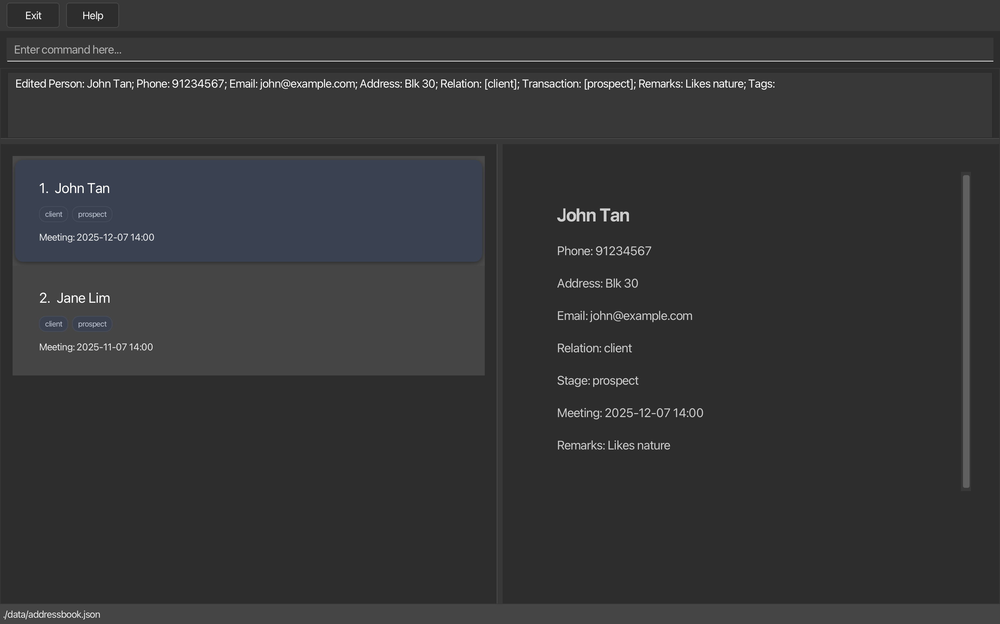
  <p style="text-align: center; margin-top: 4px;"><i>Edited the first person's phone number and email address</i></p>
</div>
&nbsp;

* `edit 2 n/Betsy Crower t/`

* `edit 1 m/2025-11-10 09:30` 
  * Updates the `1st` contact’s meeting to the specified date and time.
&nbsp;
<div style="display: inline-block; text-align: center;">
  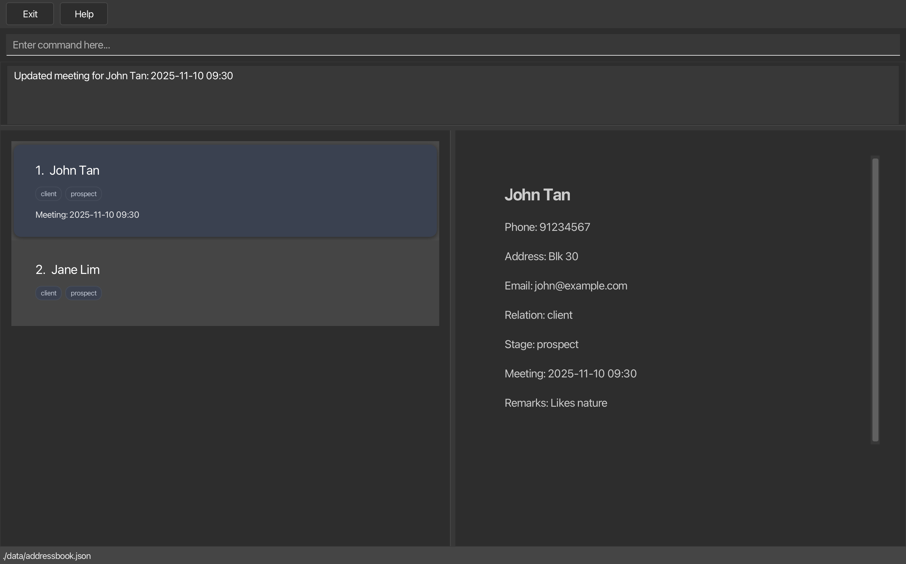
  <p style="text-align: center; margin-top: 4px;"><i>Updated John's meeting</i></p>
</div>
&nbsp;

* `edit 2 m/` 
  * Clears the meeting for the `2nd` contact.
&nbsp;
<div style="display: inline-block; text-align: center;">
  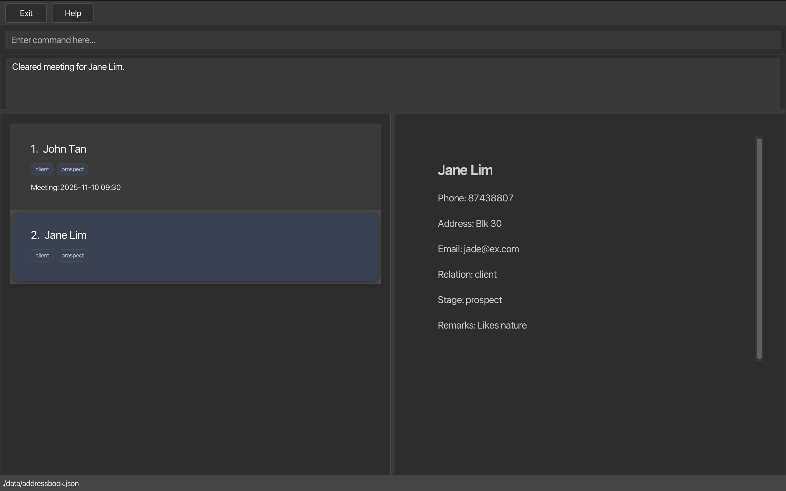
  <p style="text-align: center; margin-top: 4px;"><i>Cleared a meeting for Jane Lim</i></p>
</div>
&nbsp;

<box type="warning" seamless>

**Caution:**
**When editing tags, the existing tags of the person will be removed i.e. adding of tags is not cumulative.
Back up your data first.
</box>
&nbsp;

&nbsp;

&nbsp;

### Adding a relation : `relation`

Adds a relation to an existing contact in Homey. Use this command to edit the relation of an existing contact.

**Format:**
`relation INDEX RELATION`

**How it works:**
* Adds the specified relational tag to the person at the specified `INDEX`. The index refers to the index number shown in the displayed person list. The index **must be a positive integer** 1, 2, 3, …​
* The specified `RELATION` must be a valid relation: 'client' or 'vendor'.
* The `RELATION` is case-insensitive (e.g., `Client`, `CLIENT` and `client` are treated the same).
* Existing values will be updated to the input values.

**Examples:**
*  `relation 2 client` Edits the relational tag of the 2nd person to be `client`.
&nbsp;
<div style="display: inline-block; text-align: center;">
  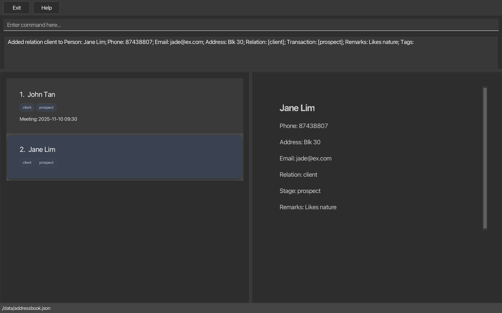
  <p style="text-align: center; margin-top: 4px;"><i>Updated Jane's relation</i></p>
</div>
&nbsp;

*  `relation 1 vendor` Edits the relational tag of the 1st person to be `vendor`.
&nbsp;

&nbsp;

### Tracking Deal Progress

Homey helps you easily track a contact's deal progress.
You can use the `transaction` command to mark where each deal currently stands, from early lead to closed sale.

**General behaviour:**
- **Stage-based tracking:** Each contact has a single transaction stage tag that shows their current deal 
progress.
- **Always present:** You cannot remove a transaction stage tag — a partner must always have one.
- **Defined stages:** Valid stages are `prospect`, `negotiating`, and `closed`.
- **Instant updates:** When you change the stage, the partner's tag updates immediately.

#### Updating the transaction stage: `transaction INDEX s/TRANSACTION_STAGE`

You can update a contact’s deal progress by replacing their current transaction stage. This is useful when a deal moves
forward or changes status, helping you maintain an accurate overview of your active deals.

**Format:** `transaction INDEX s/TRANSACTION STAGE`

**How it works:**
* Replaces the transaction stage of the contact at the specified `INDEX` to `TRANSACTION STAGE`.
* The given `TRANSACTION STAGE` must be one of the following: `prospect`, `negotiating` or `closed`.
* `TRANSACTION STAGE` is case-insensitive (e.g. `prOsPECT` works the same as `prospect`)
* Additional whitespace is accepted (e.g. `s/   closed` works the same as `s/closed`)

**Examples:**
* `transaction 1 s/closed`
  * Replaces the transaction stage tag of the 1st contact to be `closed`.
&nbsp;
<div style="display: inline-block; text-align: center;">
  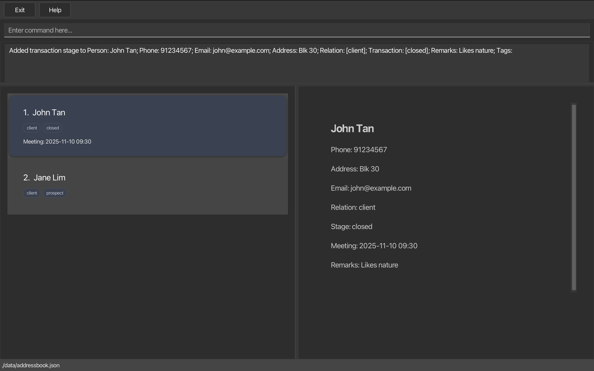
  <p style="text-align: center; margin-top: 4px;"><i>Changed John's transaction stage to "closed"</i></p>
</div>
&nbsp;

&nbsp;

### Adding Remarks 

Homey lets you effortlessly record notes about each contact for quick reference.
You can use the `remark` command to add, update or remove personal notes such as preferences, reminders or follow-ups.

**General behaviour:**
- **Flexible usage:** You can add, edit, or delete remarks for any contact.
- **Instant updates:** Changes appear immediately on the partner’s profile.
- **Hidden by default:** The `remark` field only appears after a remark has been added.

#### Adding or editing a remark: `remark INDEX rm/REMARK`

You can add a new remark or update an existing one for the selected contact to capture important details and
stay organized.

**Format:** `remark INDEX rm/REMARK`

**How it works:**
* You can replace the existing remark of the contact at the specified `INDEX` with the given `REMARK`.
* If the partner at `INDEX` does not have a remark, the new `REMARK` will be added.
* If you leave `REMARK` empty (e.g. `remark 1 rm/`), the remark will be removed.
* Extra spaces around `rm/` are ignored — e.g. `rm/   Has pets` works the same as `rm/Has pets`

**Examples:**
* `remark 1 rm/Likes windows` 
  * Replaces the remark of the 1st contact to be "Likes windows".
&nbsp;
<div style="display: inline-block; text-align: center;">
  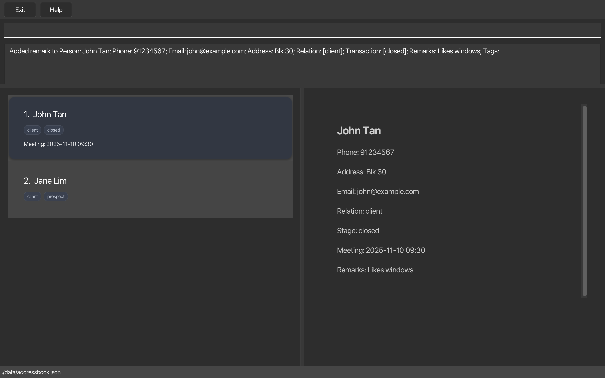
  <p style="text-align: center; margin-top: 4px;"><i>Updated John's remark</i></p>
</div>
&nbsp;
* `remark 1 rm/` 
  * Removes the remark of the 1st contact.
    &nbsp;
<div style="display: inline-block; text-align: center;">
  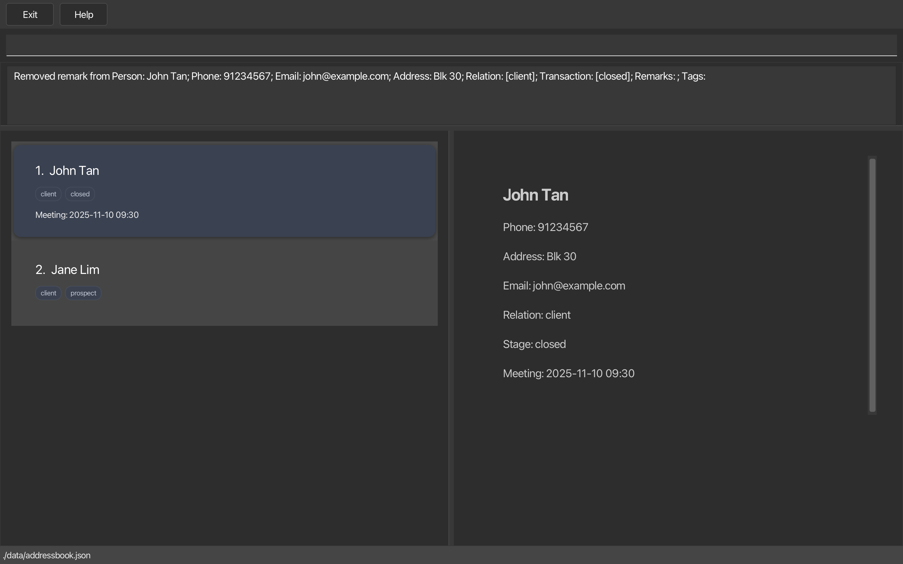
  <p style="text-align: center; margin-top: 4px;"><i>Removed John's remark</i></p>
</div>
&nbsp;

&nbsp;

### Finding Your Contacts

Homey helps you quickly locate any **active** contacts in your property database. You can search using `find` command with different filters to match your workflow needs.

**General search rules** (applies to name, address, and tag searches):
- **Case-insensitive:** Uppercase and lowercase letters are treated the same - typing `john` will match `John`
- **Partial matching:** You do not have to type the full word - typing `Han` will find `Hans`
- **Multiple keywords:** Use spaces between words to search for multiple terms at once
- **Order does not matter:** Keywords can be in any order - `Doe John` will match `John Doe`
- **Single search type only:** You can only use one prefix at a time (e.g., combining `find a/Hougang t/condo` is not supported)

#### Find by name: `find`

You can search for contacts whose names contain keywords you specify. This is useful when you remember a contact's name but need to pull up their full details quickly.

**Format:** `find KEYWORD [MORE_KEYWORDS]`

**How it works:**
* Only the contact names are searched
* All general search rules apply: case-insensitive matching, partial matching, multiple keywords, and flexible keyword order

Examples:
* `find John` returns `john` and `John Doe`
* `find ale` returns `Alex Yeoh` and `Alexandra Tan`
* `find john ja` returns `John Tan`, `Jane Lim`
&nbsp;
<div style="display: inline-block; text-align: center;">
  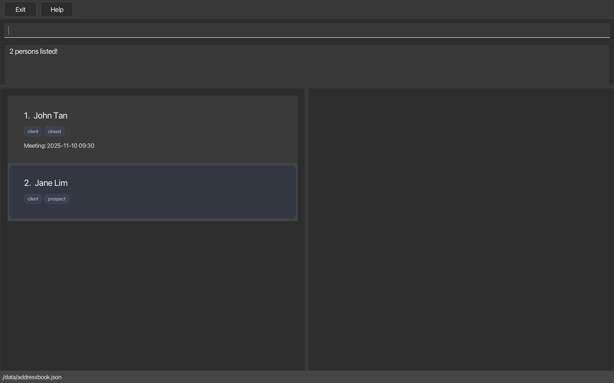
  <p style="text-align: center; margin-top: 4px;"><i>Displays contacts whose names contain 'john' or 'ja'</i></p>
</div>
&nbsp;

#### Find by address: `find a/`

You can search for contacts based on their address. This is particularly useful when you are managing properties in specific neighbourhoods or planning site visits in the same area.

**Format:** `find a/KEYWORD [MORE_KEYWORDS]` or `find a/"PHRASE"`

**How it works:**
* Only the address field is searched
* To match an exact phrase, wrap it in quotation marks (" "). Homey will then return **only addresses containing that contiguous phrase**.
* All general search rules apply: case-insensitive matching, partial matching, multiple keywords, and flexible keyword order

Examples:
* `find a/Bedok` returns all persons living in `Bedok`
* `find a/"bedok north"` returns only contacts whose address includes the exact phrase `bedok north`
* `find a/30` returns all persons whose addresses contain `30`
&nbsp;
<div style="display: inline-block; text-align: center;">
  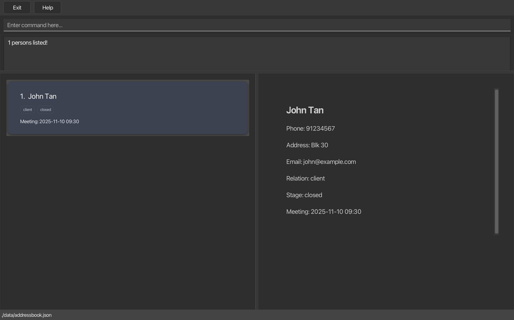
  <p style="text-align: center; margin-top: 4px;"><i>Displays contacts whose addresses contain "30"</i></p>
</div>
&nbsp;

#### Find by tag: `find t/`

You can search for contacts with specific tags you have assigned them. Tags help you organise contacts by categories like `referral`, `firsttimebuyer` or `investor` and many more.

**Format:** `find t/KEYWORD [MORE_KEYWORDS]`

**How it works:**
* Only the tag field is searched 
* Only contacts with at least one tag are searched - contacts without any tags will not appear in results
* All general search rules apply: case-insensitive matching, partial matching, multiple keywords, and flexible keyword order

Examples:
* `find t/condo` returns all persons tagged with `condo`
* `find t/buyer budget` returns persons tagged with either `buyer` or `budget`
* `find t/bu` returns all persons with tags containing `bu` (e.g., `firsttimebuyer`, `budget`)
&nbsp;
<div style="display: inline-block; text-align: center;">
  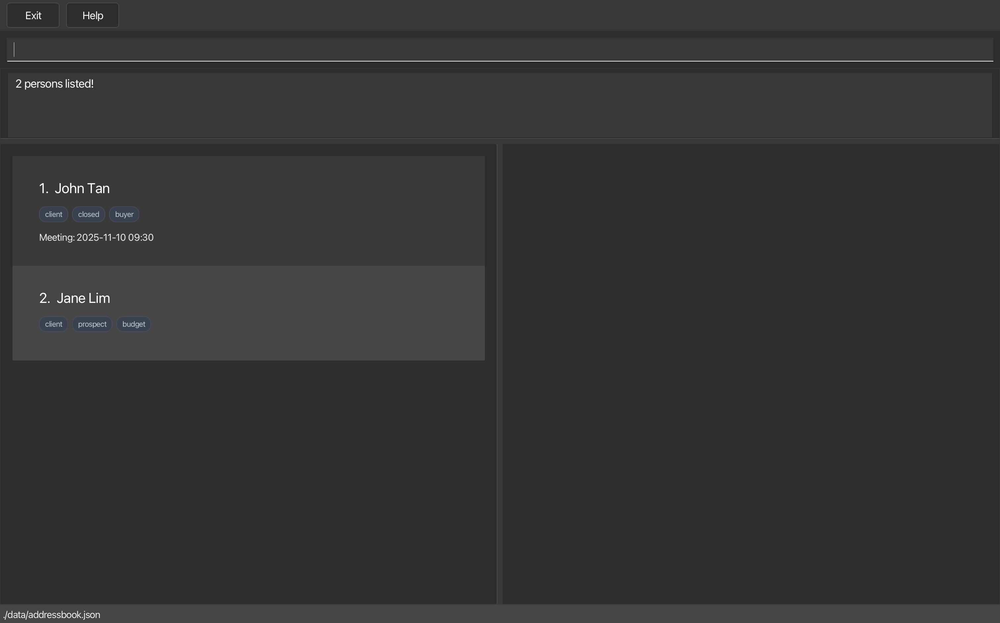
  <p style="text-align: center; margin-top: 4px;"><i>Displays contacts whose tags contain 'bu'</i></p>
</div>
&nbsp;

#### Find by relation: `find r/`

You can filter your contacts by whether they are property sellers or buyers. This helps you quickly segment your contact list when you need to contact all vendors about new listings or reach out to clients looking for properties.

**Format:** `find r/RELATION`

**How it works:**
* Only the relation field is searched
* You must type the exact relation type - partial words like `ven` will not work
* You can only search for one relation at a time
* Case-insensitive matching applies - `VENDOR`, `Vendor` and `vendor` all work

**Available relations:**
* `vendor`
* `client`

Examples:
* `find r/client` returns all persons with relation `client`
* `find r/vendor` returns all persons with relation `vendor`
&nbsp;
<div style="display: inline-block; text-align: center;">
  
  <p style="text-align: center; margin-top: 4px;"><i>Displays contacts whose relation is vendor</i></p>
</div>
&nbsp;

#### Find by transaction stage: `find s/`

You can filter contacts based on where they are in your sales pipeline. This helps you prioritise follow-ups, whether you need to check in with active negotiations or reconnect with potential clients.

**Format:** `find s/TRANSACTION_STAGE`

**How it works:**
* Only the transaction field is searched
* You must type the exact stage name - partial words like `pros` will not work
* You can only search for one stage at a time
* Case-insensitive matching applies - `Prospect`, `PROSPECT` and `prospect` all work

**Available stages:**
* `prospect`
* `negotiating`
* `closed`

Examples:
* `find s/prospect` returns all persons with transaction stage `prospect`
* `find s/negotiating` returns all persons with transaction stage `negotiating`
* `find s/closed` returns all persons with transaction stage `closed`
&nbsp;
<div style="display: inline-block; text-align: center;">
  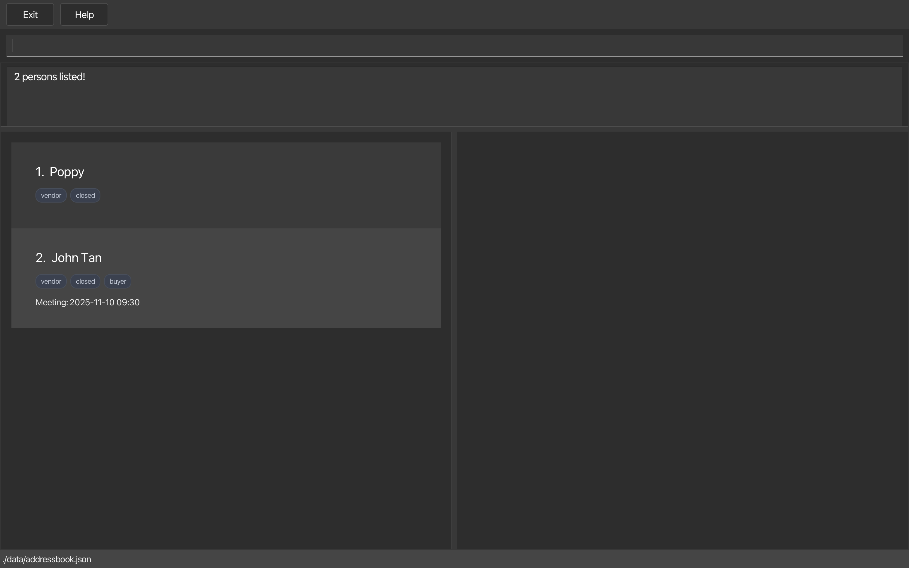
  <p style="text-align: center; margin-top: 4px;"><i>Displays contacts whose transaction stage is closed</i></p>
</div>
&nbsp;

&nbsp;

### Archiving Your Contacts

Homey allows you to archive contacts you no longer actively work with, removing them from your main view while preserving all their information. This helps keep your workspace organised without permanently deleting any contact.

General archiving behaviour:
- **Hidden but retained:** Archived contacts are removed from the **active list** but remain safely stored in the system.
- **Viewable on demand:** You can view all archived contacts using `list archived` or `list archive`.
- **Restoration available:** Use `unarchive` to move a contact back to the **active list** whenever needed.
- **Restricted interaction:** Commands such as `find`, `list meeting`, and `edit` **do not** work on archived contacts — **unarchive them first** to interact with or modify their details.

#### Archive a contact: `archive`

Archives a contact by moving them out of the active contact list.  
Only works when viewing the active list (after using `list` or `list active`).

Format: `archive INDEX`

How it works:
* Archives the person at the specified `INDEX` (as shown in the current list).
* The index must be a positive integer - e.g. `1`, `2`, `3`, ...
* Only works when viewing the active list (i.e. after using `list`).
* Once archived, the person will no longer appear in the active contact list.

Example:
* `archive 2` archives the 2nd person in the active list.
  &nbsp;
<div style="display: inline-block; text-align: center;">
  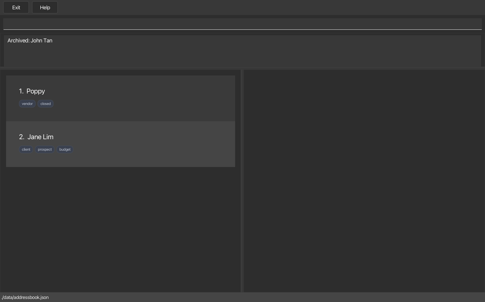
  <p style="text-align: center; margin-top: 4px;"><i>Archived John's contact</i></p>
</div>
&nbsp;

#### Unarchive a contact: `unarchive`

Restores an archived contact back to the active contact list.  
Only works when viewing the archived list (after using `list archived`).

Format: `unarchive INDEX`

How it works:
* Unarchives the person at the specified `INDEX` (as shown in the archived list).
* The index must be a positive integer  e.g. `1`, `2`, `3`, ...
* Only works when viewing the archived list.
* The restored person will immediately return to the active list.

Examples:
* `unarchive 1` restores the 1st person in the archived list.
  &nbsp;
<div style="display: inline-block; text-align: center;">
  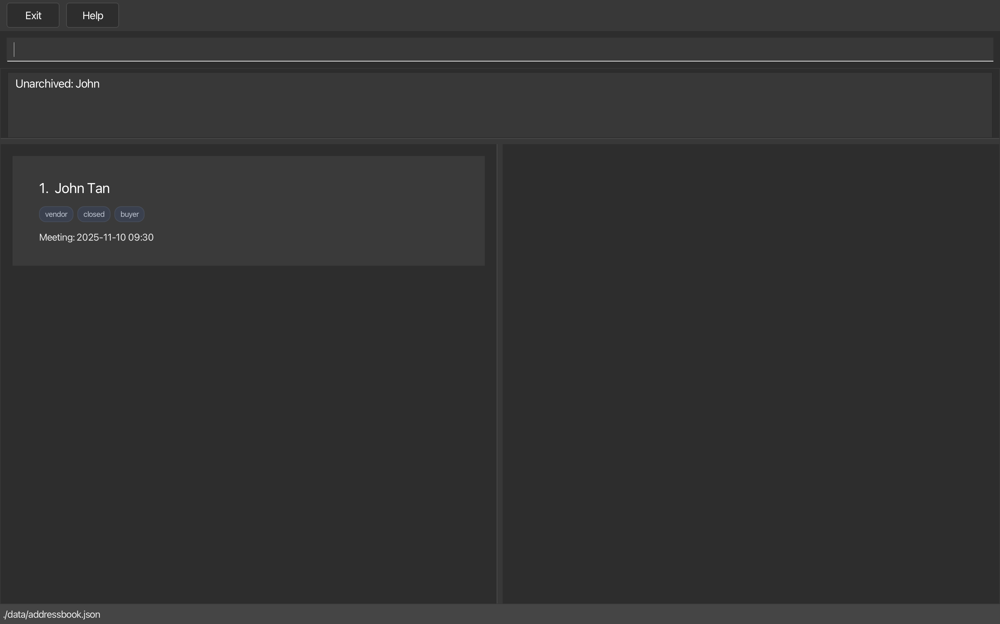
  <p style="text-align: center; margin-top: 4px;"><i>Unarchived 1st contact in the archive list</i></p>
</div>
&nbsp;

<div style="display: inline-block; text-align: center;">
  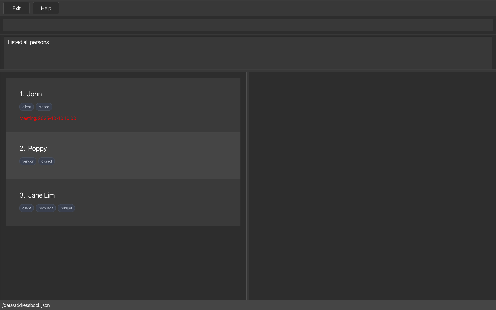
  <p style="text-align: center; margin-top: 4px;"><i>Contact returns to the active list</i></p>
</div>
&nbsp;

&nbsp;

### Viewing contact details: `view`

You can open the detailed information card of a specific contact directly without clicking on them. This is useful when you want to quickly access a contact's full details using just the keyboard.

**Format:** `view INDEX`

**How it works:**
* Opens the detailed contact card on the right panel for the person at the specified `INDEX`
* The index refers to the index number shown in the displayed contact list
* The index must be a positive integer: 1,2,3, and so on
* Works with any currently displayed list (active, archived, filtered results)

Examples:
* `view 1` opens the detailed information card for the 1st person in the current list.
  &nbsp;
<div style="display: inline-block; text-align: center;">
  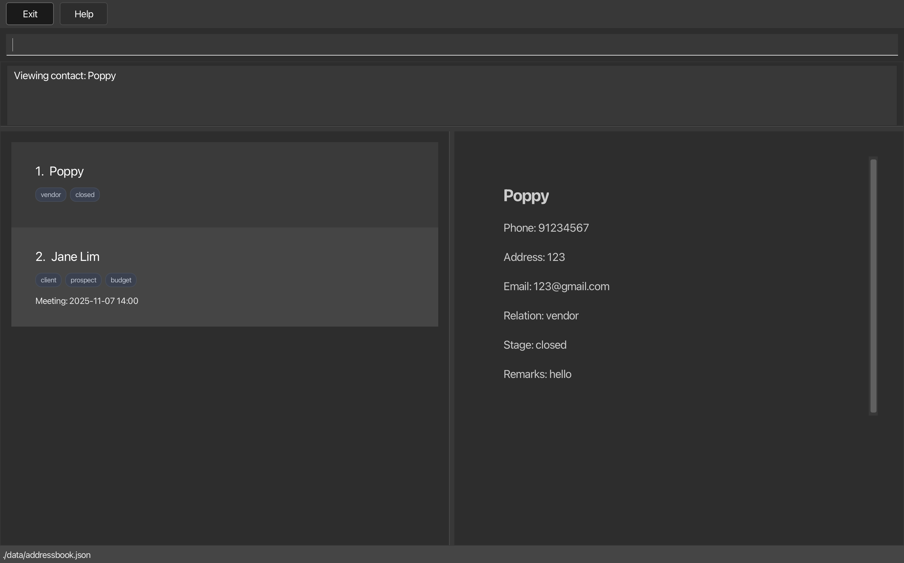
  <p style="text-align: center; margin-top: 4px;"><i>Viewing the 1st contact in the list</i></p>
</div>
&nbsp;

* `find john` followed by `view 1`
&nbsp;

&nbsp;

### Deleting a Contact : `delete`

You can remove a contact from Homey permanently. This is useful when you no longer need to maintain a record of a particular client or vendor.

**Format:** `delete INDEX`

**How it works:**
* You must specify the index number shown in the displayed contact list
* The index must be a positive integer: 1,2,3, and so on
* The contact at the specified index will be permanently deleted

Examples:
* `list` followed by `delete 2` deletes the 2nd person in Homey.
* `find John` followed by `delete 1` deletes the 1st person in the results of the `find` command.
&nbsp;
<div style="display: inline-block; text-align: center;">
  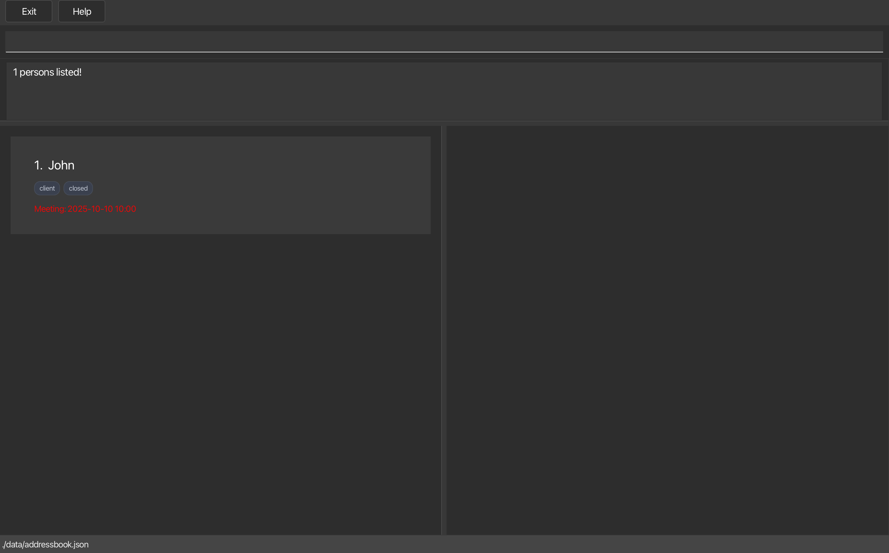
  <p style="text-align: center; margin-top: 4px;"><i>Only the contacts containing "John" are listed</i></p>
</div>
&nbsp;
<div style="display: inline-block; text-align: center;">
  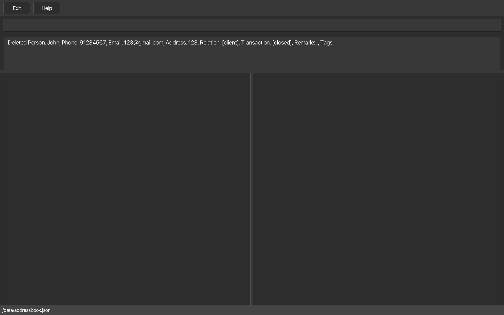
  <p style="text-align: center; margin-top: 4px;"><i>John is deleted from Homey</i></p>
</div>
&nbsp;

&nbsp;

### Clearing all entries : `clear`

You can remove all contacts from Homey at once. This is useful when you want to start fresh with a completely empty contact list.

**Format:** `clear`

**How it works:**
* All contacts in Homey will be permanently deleted
* This removes all contacts, not just the ones currently shown on your screen

<box type="warning" seamless>

**Caution:**
**Running `clear` will delete all contacts immediately without asking for confirmation.** You cannot undo this action.
Back up your data first.
</box>
&nbsp;

&nbsp;

### Exiting the program : `exit`

You can close the Homey application safely. All your information is automatically saved before the program exits.

**Format:** `exit`

**How it works:**
* The application window will close
* All changes you made during your session are saved automatically
* You can reopen Homey anytime to access your saved contacts
&nbsp;

&nbsp;

### Saving the data

Homey automatically saves all contact data to your hard disk after every command that changes the data. There is no need to save manually.
If Homey cannot save (e.g., disk is full or lacks file permissions), an error message will appear and your changes won't be kept. 
Free up storage or check file permissions, then try again.
&nbsp;

&nbsp;

### Editing the data file

Data for Homey is saved automatically as a JSON file `[JAR file location]/data/homey.json`. If you are familiar with JSON syntax, you are welcome to update data directly by editing that data file.  

When editing the file, ensure that the data complies with the respective constraints:
* Phone number: must be a number, at least 3 digits long
* Email: must be of the format `local-part@domain`
  1. The local-part should only contain alphanumeric characters and these special characters, excluding the parentheses, (+_.-). The local-part may not start or end with any special characters.
  2. This is followed by a '@' and then a domain name. The domain name is made up of domain labels separated by periods.
     The domain name must:
      - end with a domain label at least 2 characters long
      - have each domain label start and end with alphanumeric characters
      - have each domain label consist of alphanumeric characters, separated only by hyphens, if any.
* Relation: must be `client` or `vendor`
* Transaction Stage: must be `prospect`, `negotiating` or `closed`
* Tag: must be alphanumeric
* Meeting: must be of the format `yyyy-MM-dd HH:mm` in `24-hour` format

<box type="warning" seamless>

**Caution:**
If your changes to the data file makes its format invalid, Homey will **discard all data and start with an empty data file at the next run**.  Hence, it is recommended to take a backup of the file before editing it.<br>
Furthermore, **certain edits can cause Homey to behave in unexpected ways** (e.g., if a value entered is outside the acceptable range). Therefore, edit the data file only if you are confident that you can update it correctly.
</box>
&nbsp;

&nbsp;

--------------------------------------------------------------------------------------------------------------------
&nbsp;

&nbsp;

## FAQ

**Q**: How do I transfer my data to another Computer?<br>
**A**: Install the app in the other computer and overwrite the empty data file it creates with the file that contains the data of your previous Homey home folder.

**Q**: Can Homey be used offline?<br>
**A**: Yes! Homey is designed to run locally on your computer seamlessly, so it will work even without internet access.

**Q**: What happens if I accidentally delete all contacts?<br>
**A**: If you run clear, all contacts are permanently removed from the active list. To avoid data loss, regularly backup the homey.json data file (location: [JAR file location]/data/homey.json). If you still have a backup, you can restore it by exiting the app, replacing the data file with your backup, then restarting.

**Q**: Can I undo a deletion of a contact?<br>
**A**: Once you use `delete INDEX`, the contact is permanently removed. If you intend to hide a contact temporarily, use the `archive INDEX` command instead. Archived contacts can be restored with `unarchive INDEX`.

**Q**: Can I customise or add new transaction stages beyond `prospect`, `negotiating`, `closed`?<br>
**A**: At present, the allowed stages are limited to `prospect`, `negotiating`, or `closed`. You can add a custom tag instead to supplement the given stages.

**Q**: Does Homey block overlapping meetings?<br>
**A**: No because there can be a group meeting scheduled with multiple contacts.
&nbsp;

&nbsp;

--------------------------------------------------------------------------------------------------------------------
&nbsp;

&nbsp;

## Known issues

1. **When using multiple screens**, if you move the application to a secondary screen, and later switch to using only the primary screen, the GUI will open off-screen. The remedy is to delete the `preferences.json` file created by the application before running the application again.
2. **If the Help window is shown** (e.g. when your system blocks opening the browser) and you **minimize it**, running the `help` command (or use the `Help` menu, or the keyboard shortcut `F1`) again will not restore it automatically. The remedy is to manually restore the minimized Help Window.
&nbsp;

&nbsp;

--------------------------------------------------------------------------------------------------------------------
&nbsp;

&nbsp;

## Command summary

| Action          | Format, Examples                                                                                                                                                                                                                                    |
|-----------------|-----------------------------------------------------------------------------------------------------------------------------------------------------------------------------------------------------------------------------------------------------|
| **Add**         | `add n/NAME p/PHONE_NUMBER e/EMAIL a/ADDRESS s/TRANSACTION_STAGE [rm/REMARK] [r/RELATION] [t/TAG]…​ [m/MEETING] ​` <br> e.g., `add n/James Ho p/22224444 e/jamesho@example.com a/123, Clementi Rd, 1234665 t/friend t/colleague m/2025-10-10 09:30` |
| **Clear**       | `clear`                                                                                                                                                                                                                                             |
| **Delete**      | `delete INDEX`<br> e.g., `delete 3`                                                                                                                                                                                                                 |
| **Edit**        | `edit INDEX [n/NAME] [p/PHONE_NUMBER] [e/EMAIL] [a/ADDRESS] [r/RELATION] [s/TRANSACTION_STAGE] [rm/REMARK] [t/TAG]…​ [m/MEETING] ​`<br> e.g.,`edit 2 n/James Lee e/jameslee@example.com`, `edit 3 m/2025-10-10 09:30`                               |
| **Relation**    | `relation INDEX RELATION` <br> e.g., `relation 1 vendor`                                                                                                                                                                                            |
| **Transaction** | `transaction INDEX s/TRANSACTION_STAGE` <br> e.g., `transaction 1 s/prospect`                                                                                                                                                                       |
| **Remark**      | `remark INDEX rm/REMARK` <br> e.g., `remark 1 rm/Likes nature`                                                                                                                                                                                      |
| **Find**        | `find KEYWORD [MORE_KEYWORDS]`<br> e.g., `find James Jake`                                                                                                                                                                                          |
| **Find a/**     | `find a/KEYWORD [MORE_KEYWORDS]`<br> e.g., `find a/Bedok`                                                                                                                                                                                           |
| **Find t/**     | `find t/KEYWORD [MORE_KEYWORDS]`<br> e.g., `find t/friend`                                                                                                                                                                                          |
| **Find r/**     | `find r/RELATION`<br> e.g., `find r/client`                                                                                                                                                                                                         |
| **Find s/**     | `find s/TRANSACTION_STAGE`<br> e.g., `find s/negotiating`                                                                                                                                                                                           |
| **List**        | `list [archive]` <br> e.g., `list`, `list archive`, `list meeting`                                                                                                                                                                                  |
| **Help**        | `help [TOPIC]`<br> e.g., `help add`<br><br>`help offline`                                                                                                                                                                                           |
| **Archive**     | `archive INDEX`<br> e.g., `archive 1`                                                                                                                                                                                                               |
| **Unarchive**   | `unarchive INDEX`<br> e.g., `unarchive 1`                                                                                                                                                                                                           |
| **View**        | `view INDEX`<br> e.g., `view 1`                                                                                                                                                                                                                     |

