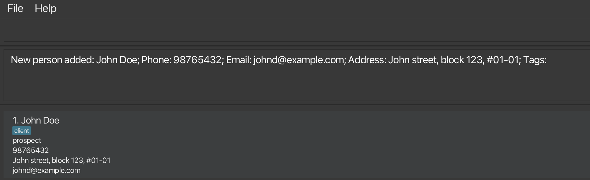
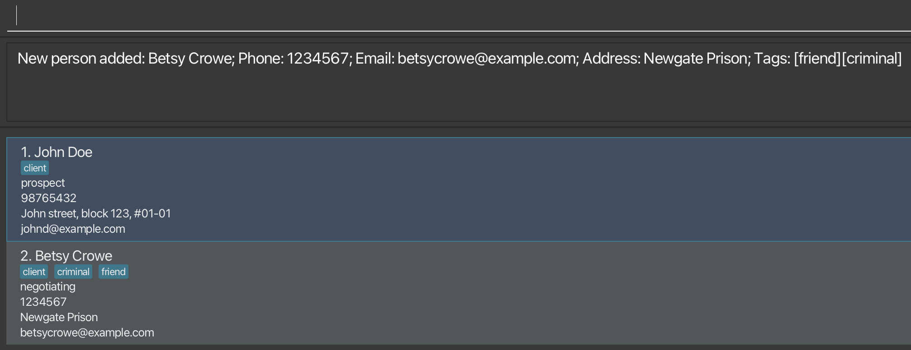
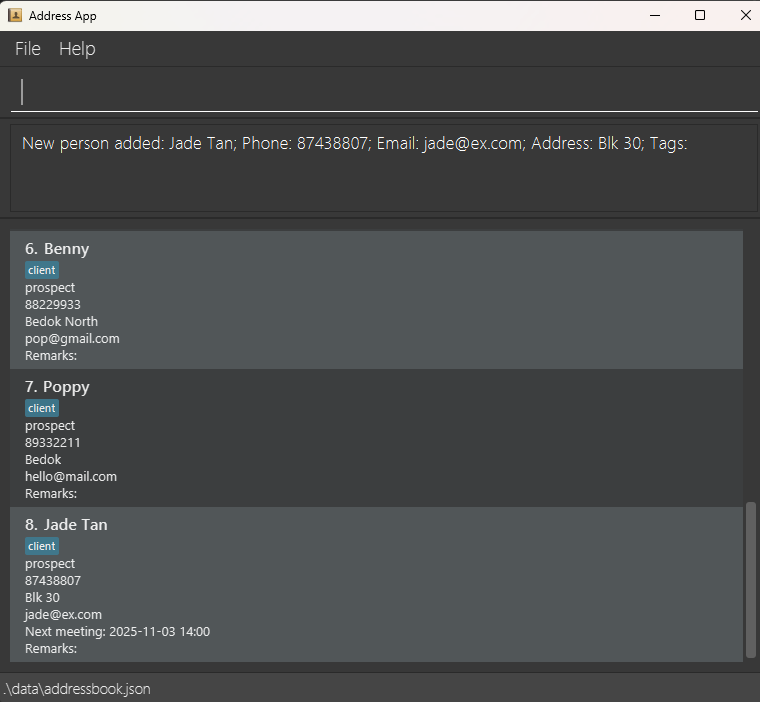
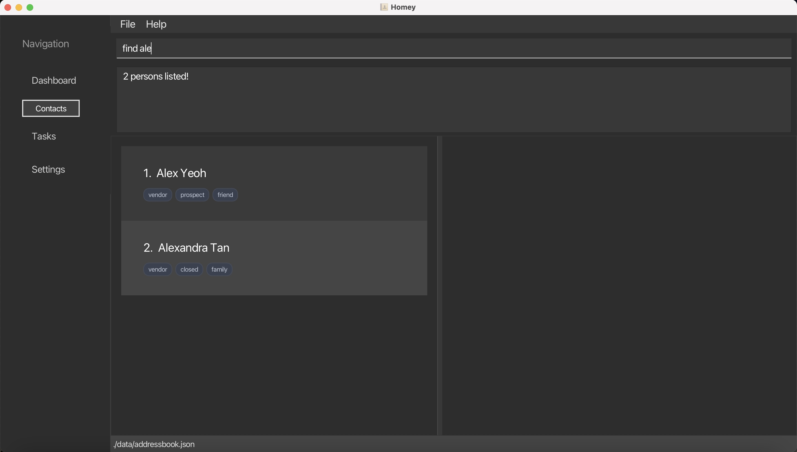
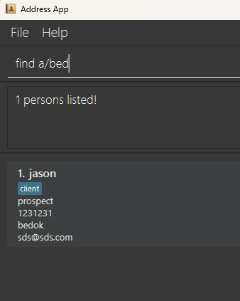
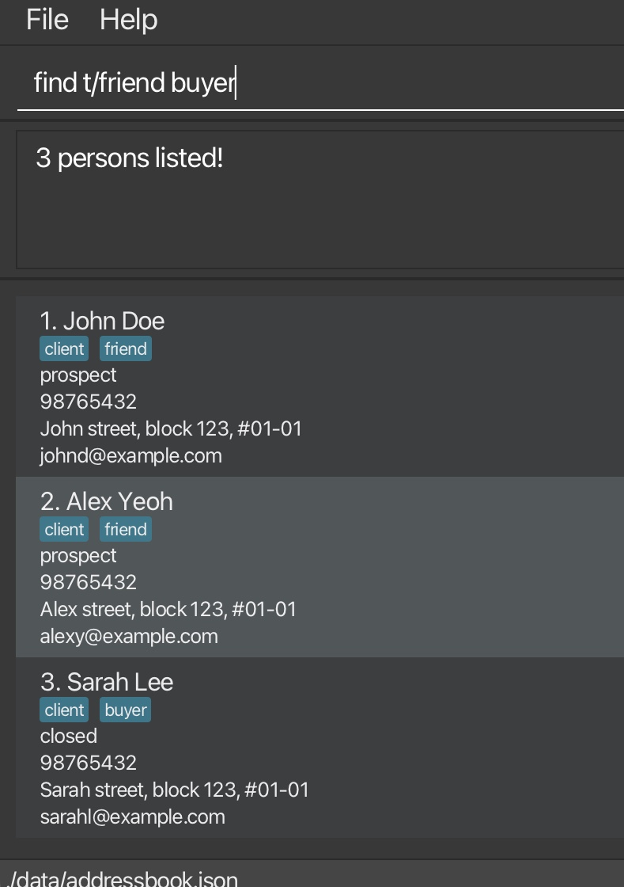
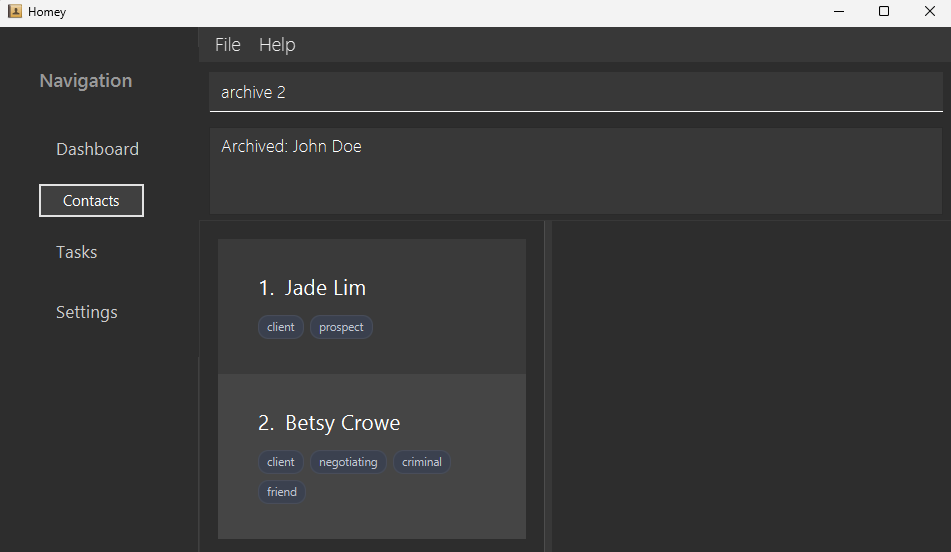
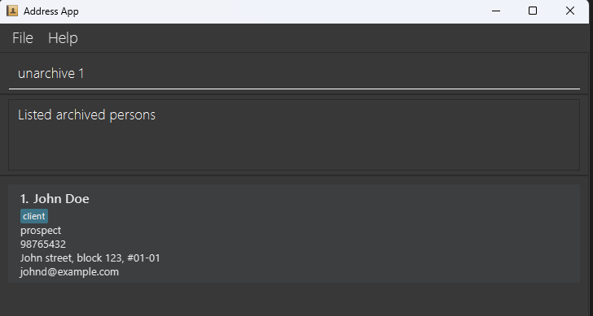
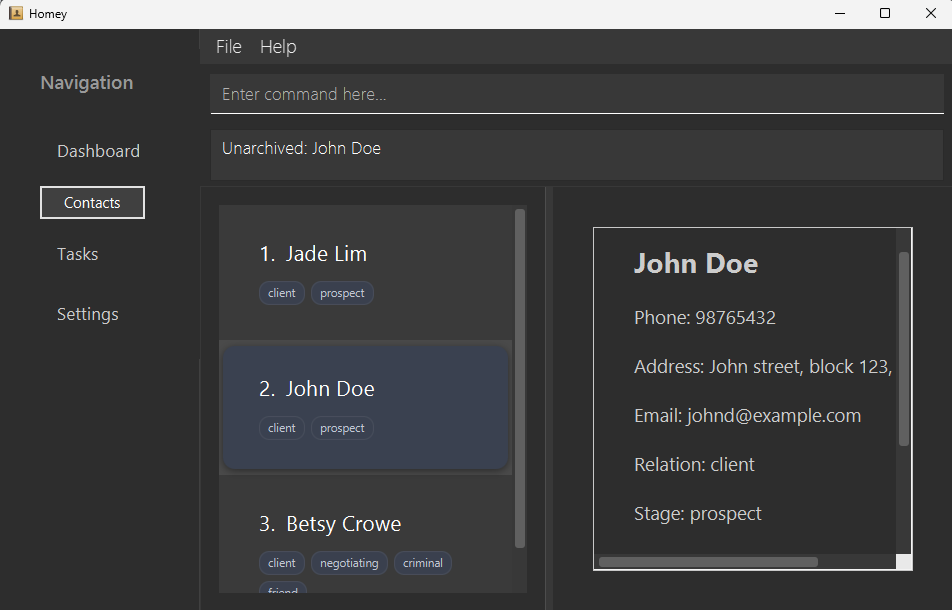

# Homey User Guide

AddressBook Level 3 (AB3) is a **desktop app for managing contacts, optimized for use via a  Line Interface** (CLI) while still having the benefits of a Graphical User Interface (GUI). If you can type fast, AB3 can get your contact management tasks done faster than traditional GUI apps.

<!-- * Table of Contents -->
<page-nav-print />

--------------------------------------------------------------------------------------------------------------------

## Quick start

1. Ensure you have Java `17` or above installed in your Computer. 
   **Mac users:** Ensure you have the precise JDK version prescribed [here](https://se-education.org/guides/tutorials/javaInstallationMac.html).

1. Download the latest `.jar` file from [here](https://github.com/se-edu/addressbook-level3/releases).

1. Copy the file to the folder you want to use as the _home folder_ for your AddressBook.

1. Open a command terminal, `cd` into the folder you put the jar file in, and use the `java -jar addressbook.jar` command to run the application. 
   A GUI similar to the below should appear in a few seconds. Note how the app contains some sample data. 
   

1. Type the command in the command box and press Enter to execute it. e.g. typing **`help`** and pressing Enter will open the User Guide in your web browser (if the browser can’t be opened, a Help window will appear instead). 
   Some example commands you can try:

   * `list` : Lists all contacts.

   * `add n/John Doe p/98765432 e/johnd@example.com a/John street, block 123, #01-01` : Adds a contact named `John Doe` to the Address Book.

   * `delete 3` : Deletes the 3rd contact shown in the current list.

   * `clear` : Deletes all contacts.

   * `exit` : Exits the app.

1. Refer to the [Features](#features) below for details of each command.

--------------------------------------------------------------------------------------------------------------------

## Features

<box type="info" seamless>

**Notes about the command format:** 

* Words in `UPPER_CASE` are the parameters to be supplied by the user. 
  e.g. in `add n/NAME`, `NAME` is a parameter which can be used as `add n/John Doe`.

* Items in square brackets are optional. 
  e.g `n/NAME [t/TAG]` can be used as `n/John Doe t/friend` or as `n/John Doe`.

* Items with `…`​ after them can be used multiple times including zero times. 
  e.g. `[t/TAG]…​` can be used as ` ` (i.e. 0 times), `t/friend`, `t/friend t/family` etc.

* Parameters can be in any order. 
  e.g. if the command specifies `n/NAME p/PHONE_NUMBER`, `p/PHONE_NUMBER n/NAME` is also acceptable.

* Extraneous parameters for commands that do not take in parameters (such as `list`, `exit` and `clear`) will be ignored. 
  e.g. if the command specifies `list 123`, it will be interpreted as `list`.

* `help` accepts an optional topic to deep-link to a specific section of this guide.
  e.g. `help add`, `help edit` and `help delete`.

* If you are using a PDF version of this document, be careful when copying and pasting commands that span multiple lines as space characters surrounding line-breaks may be omitted when copied over to the application.
</box>

### Viewing help : `help [topic]`

Opens the User Guide in your web browser.
If the browser cannot be opened (e.g. blocked by the environment), a Help window is shown so you can copy the link manually.

* User enters help add command. The browser automatically opens the "Adding a person" section of the User Guide.

* Opens the User Guide in your web browser. If blocked, the Help window appears instead.

Format: `help [topic]`

* `topic` is optional and deep-links to a specific section of this guide.
* Topic matching is case-insensitive and ignores surrounding spaces.
* Supported topics: `add`, `edit`, `delete`, `find`, `list`, `help`, `find a/`, `find t/`, `relation`, `transaction`, `archive`, `unarchive`, `remark`, `list meeting`, `clear` and `exit`.

Examples:
* `help` opens the User Guide home.
* `help add` opens the "Adding a person" section.
* `help edit` opens the "Editing a person" section.
* You can also open help using the Help menu or by pressing F1.

### Adding a person: `add`

Adds a person to the address book.

Format: `add n/NAME p/PHONE_NUMBER e/EMAIL a/ADDRESS s/TRANSACTION_STAGE [rm/REMARK] [r/RELATION] [t/TAG] [m/MEETING]…​`

<box type="tip" seamless>

**Tips:** 
* A person can have any number of tags (including 0).
* The s/TRANSACTION_STAGE field only accepts the values `prospect`, `negotiating` or `closed`.
* The r/RELATION field only accepts the values `client` or `vendor`.
* The m/MEETING field is optional — use it to record a future meeting date and time (e.g. 2025-11-03 14:00).
* The r/RELATION field is optional. The default relation for a new contact is client.
* The rm/REMARK field is optional — use it to add additional details regarding the person.
The remark field will be empty if no remark is given.
</box>

Examples:
* `add n/Jade Lim p/87438807 e/jade@ex.com a/Blk 30 s/prospect m/2025-11-03 14:00`
* `add n/John Doe p/98765432 e/johnd@example.com a/John street, block 123, #01-01 s/prospect` 
  * Adds a person named John Doe whose phone number is `98765432`, email is `johnd@example.com`, address is
  `John street, block 123, #01-01`, relation is `client`, and transaction stage is `prospect`.
  
* `add n/Betsy Crowe t/friend e/betsycrowe@example.com a/Newgate Prison p/1234567 s/negotiating t/criminal`
  * Adds a person named Betsy Crowe whose phone number is `1234567`, email is `betsycrowe@example.com`, address is
  `Newgate Prison`, relation is `client`, transaction stage is `negotiating`, and is tagged as `criminal` and `friend`.
  

### Listing all persons : `list`

Shows a list of all persons in the address book.

Format: `list`

### Editing a person : `edit`

Edits an existing person in the address book.

Format: `edit INDEX [n/NAME] [p/PHONE] [e/EMAIL] [a/ADDRESS] [s/TRANSACTION_STAGE] [rm/REMARK] [t/TAG] [m/MEETING]…​`

* Edits the person at the specified `INDEX`. The index refers to the index number shown in the displayed person list. The index **must be a positive integer** 1, 2, 3, …​
* At least one of the optional fields must be provided.
* Existing values will be updated to the input values.
* When editing tags, the existing tags of the person will be removed i.e adding of tags is not cumulative.
* You can remove all the person’s tags by typing `t/` without
    specifying any tags after it.
* To clear an existing meeting, type m/ with no value after it.

Examples:
*  `edit 1 p/91234567 e/johndoe@example.com` Edits the phone number and email address of the 1st person to be `91234567` and `johndoe@example.com` respectively.
*  `edit 2 n/Betsy Crower t/` Edits the name of the 2nd person to be `Betsy Crower` and clears all existing tags.
*  `edit 5 m/2025-11-10 09:30` Updates the 5th person’s next meeting to `10 Nov 2025 at 9:30 AM.`
*  `edit 5 m/` Clears the meeting time for the 5th person.

### Add relational tag : `relation`

Adds a relational tag to an existing person in the address book.

Format: `relation INDEX RELATION`

* Adds the specified relational tag to the person at the specified `INDEX`. The index refers to the index number shown in the displayed person list. The index **must be a positive integer** 1, 2, 3, …​
* The specified `RELATION` must be a valid relation: 'client' or 'vendor'.
* Existing values will be updated to the input values.

Examples:
*  `relation 2 client` Edits the relational tag of the 2nd person to be `client`.
   
*  `relation 1 vendor` Edits the relational tag of the 1st person to be `vendor`.

### Changing the transaction stage : `transaction`

Replaces the transaction stage tag of an existing person to the given stage.

Format: `transaction INDEX s/TRANSACTION_STAGE`

* Replaces the transaction stage of the person at the specified `INDEX`.
* The given `TRANSACTION_STAGE` must be one of the following: `prospect`, `negotiating` or `closed`.
* Additional whitespace is accepted.
* `TRANSACTION_STAGE` is case-sensitive.
* The Transaction Stage tag cannot be removed, only replaced.

Examples:
* `transaction 1 s/prospect` Replaces the transaction stage tag of the 1st person to be `prospect`.

* `transaction 2 s/negotiating` Replaces the transaction stage tag of the 2nd person to be `negotiating`.

* `transaction    2     s/  closed` Replaces the transaction stage tag of the 3rd person to be `closed`.

### Adding a remark: `remark`

Edits the remark of an existing person.

Format: `remark INDEX rm/REMARK`

* The remark of the person at `INDEX` is replaced with the given `REMARK`.
* If the person at `INDEX` does not have a remark, the given `REMARK` is added.
* If `REMARK` is empty (e.g. `remark 1 rm/`), the remark of the person at `INDEX` is removed.

Examples:
* `remark 1 rm/Likes nature` Replaces the remark of the 1st person to be "Likes nature".
* `remark 1 rm/` Removes the remark of the 1st person.

### Setting a meeting with date and time

This feature helps property agents schedule, update, and view upcoming client meetings directly within Homey.

---

### Adding a meeting when creating a contact : `add`

You can add a meeting date and time when adding a new contact.

**Format:**  
`add n/NAME p/PHONE e/EMAIL a/ADDRESS s/STAGE m/MEETING_DATETIME`

* `MEETING_DATETIME` must follow **YYYY-MM-DD HH:mm** format.  
  Example: `2025-11-03 14:00` (3 Nov 2025, 2:00 PM)

**Example:**
`add n/Jade Tan p/87438807 e/jade@ex.com a/Blk 30 s/prospect m/2025-11-03 14:00`

&nbsp;
<box type="tip" seamless>
You can omit the `m/` prefix if the contact does not have a scheduled meeting.
</box>

---

### Editing a contact’s meeting : `edit`

Updates or removes a contact’s meeting date and time.

**Format:**  
`edit INDEX m/MEETING_DATETIME`

* Use the contact’s index as shown in the contact list.
* To remove a meeting, leave the `m/` field empty.

**Examples:**
* `edit 1 m/2025-11-10 09:30` Updates the 1st contact’s meeting.
* `edit 2 m/` Clears the meeting from the 2nd contact.

---

### Listing contacts by meeting date : `list meeting`

Displays all contacts with meetings, sorted by the **earliest meeting first**.  
Contacts without meetings or that are archived will not be shown.

**Format:**  
`list meeting`

**Examples:**
list meeting

&nbsp;
Shows all contacts with meetings in ascending order of date and time.

<box type="tip" seamless>
Use this command to quickly view who you are meeting next.
</box>

---

### Locating persons by name: `find`

Finds persons whose names contain any of the given keywords.

Format: `find KEYWORD [MORE_KEYWORDS]`

* The search is case-insensitive. e.g `hans` will match `Hans`
* The order of the keywords does not matter. e.g. `Hans Bo` will match `Bo Hans`
* Only the name is searched.
* Partial matches are supported - e.g. `Han` will match `Hans`
* Persons matching at least one keyword will be returned (i.e. `OR` search).
  e.g. `Hans Bo` will return `Hans Gruber`, `Bo Yang`

Examples:
* `find John` returns `john` and `John Doe`
* `find ale` returns `Alex Yeoh`
  
* `find alex david` returns `Alex Yeoh`, `David Li` 
  

### Locating persons by address: `find a/`

Finds persons whose addresses contain any of the given keywords.

Format: `find a/KEYWORD [MORE_KEYWORDS]`

* The search is case-insensitive. e.g. `bedok` will match `Bedok`
* The order of the keywords does not matter. e.g. `bedok north` will match `North Bedok`
* Only the address is searched.
* Partial matches are supported — e.g. `bed` will match `Bedok`

Examples:
* `find a/Bedok` returns all persons living in `Bedok`
* `find a/bed` returns all persons living in `bedok` and `Bedok` or other addresses with `bed` 
  

### Locating persons by tag: `find t/`

Finds persons whose tags contain any of the given keywords.

Format: `find t/KEYWORD [MORE_KEYWORDS]`

* The search is case-insensitive. e.g. `friend` will match `Friend`
* The order of the keywords does not matter.
* Only tags are searched.
* Partial matches are supported - e.g. `fri` will match `friend`
* Persons matching at least one keyword will be returned (i.e. `OR` search).

Examples:
* `find t/friend` returns all persons tagged with `friend`
* `find t/fri` returns all persons with tags containing `fri` (e.g., `friend`, `Friday`)
* `find t/friend buyer` returns persons tagged with either `friend` or `buyer`
  

### Archiving persons: `archive`

Moves a person from the active list to the **archived list**, hiding them from normal view.
Use this when you want to temporarily remove a contact without deleting their information.

Format: `archive INDEX`

* Archives the person at the specified `INDEX` (as shown in the currently displayed list).
* The index must be a positive integer - e.g. `1`, `2`, `3`, ...
* The command only works when viewing the **active list** (i.e. after using list).
* Archived persons can be viewed later using `list archived` or `list archive`.

Examples:
* `archive 2` archives the 2nd person in the active list.

### Unarchiving persons: `unarchive`

Restores a person from the **archived list** back to the **active list**.

Format: `unarchive INDEX`

* Unarchives the person at the specified `INDEX` (as shown in the **archived list**).
* The index must be a positive integer - e.g. `1`, `2`, `3`, ...
* The command only works when viewing the **archived list** (i.e. after using `list archived`).
* The restored person will reappear in the active list
* Unarchived persons can be viewed later using `list active` or `list`.

Examples:
* `unarchive 1` unarchives the first person in the archived list.

### Deleting a person : `delete`

Deletes the specified person from the address book.

Format: `delete INDEX`

* Deletes the person at the specified `INDEX`.
* The index refers to the index number shown in the displayed person list.
* The index **must be a positive integer** 1, 2, 3, …​

Examples:
* `list` followed by `delete 2` deletes the 2nd person in the address book.
* `find Betsy` followed by `delete 1` deletes the 1st person in the results of the `find` command.

### Clearing all entries : `clear`

Clears all entries from the address book.

Format: `clear`

### Exiting the program : `exit`

Exits the program.

Format: `exit`

### Saving the data

AddressBook data are saved in the hard disk automatically after any command that changes the data. There is no need to save manually.

### Editing the data file

AddressBook data are saved automatically as a JSON file `[JAR file location]/data/addressbook.json`. Advanced users are welcome to update data directly by editing that data file.

<box type="warning" seamless>

**Caution:**
If your changes to the data file makes its format invalid, AddressBook will discard all data and start with an empty data file at the next run.  Hence, it is recommended to take a backup of the file before editing it. 
Furthermore, certain edits can cause the AddressBook to behave in unexpected ways (e.g., if a value entered is outside the acceptable range). Therefore, edit the data file only if you are confident that you can update it correctly.
</box>

--------------------------------------------------------------------------------------------------------------------

## FAQ

**Q**: How do I transfer my data to another Computer? 
**A**: Install the app in the other computer and overwrite the empty data file it creates with the file that contains the data of your previous AddressBook home folder.

--------------------------------------------------------------------------------------------------------------------

## Known issues

1. **When using multiple screens**, if you move the application to a secondary screen, and later switch to using only the primary screen, the GUI will open off-screen. The remedy is to delete the `preferences.json` file created by the application before running the application again.
2. **If the Help window is shown** (e.g. when your system blocks opening the browser) and you **minimize it**, running the `help` command (or use the `Help` menu, or the keyboard shortcut `F1`) again will not restore it automatically. The remedy is to manually restore the minimized Help Window.

--------------------------------------------------------------------------------------------------------------------

## Command summary

| Action          | Format, Examples                                                                                                                                                                                                                      |
|-----------------|---------------------------------------------------------------------------------------------------------------------------------------------------------------------------------------------------------------------------------------|
| **Add**         | `add n/NAME p/PHONE_NUMBER e/EMAIL a/ADDRESS s/TRANSACTION_STAGE [r/RELATION] [t/TAG] [m/MEETING]…​`   e.g., `add n/James Ho p/22224444 e/jamesho@example.com a/123, Clementi Rd, 1234665 t/friend t/colleague m/2025-10-10 09:30` |
| **Clear**       | `clear`                                                                                                                                                                                                                               |
| **Delete**      | `delete INDEX`  e.g., `delete 3`                                                                                                                                                                                                   |
| **Edit**        | `edit INDEX [n/NAME] [p/PHONE_NUMBER] [e/EMAIL] [a/ADDRESS] [s/TRANSACTION_STAGE] [t/TAG] [m/MEETING]…​`  e.g.,`edit 2 n/James Lee e/jameslee@example.com`, `edit 3 m/2025-10-10 09:30`                                            |
| **Relation**    | `relation INDEX RELATION`   e.g., `relation 1 vendor`                                                                                                                                                                              
| **Transaction** | `transaction INDEX s/TRANSACTION_STAGE`   e.g., `transaction 1 s/prospect`                                                                                                                                                         
| **Find**        | `find KEYWORD [MORE_KEYWORDS]`  e.g., `find James Jake`                                                                                                                                                                            |
| **Find a/**     | `find a/KEYWORD [MORE_KEYWORDS]`  e.g., `find Bedok`                                                                                                                                                                               |
| **Find t/**     | `find t/KEYWORD [MORE_KEYWORDS]`  e.g., `find t/friend`                                                                                                                                                                            |
| **List**        | `list [archive]`   e.g., `list`, `list archive`                                                                                                                                                                                    |
| **Help**        | `help [topic]`  e.g., `help add`                                                                                                                                                                                                   |
| **Archive**     | `archive INDEX`  e.g., `archive 1`                                                                                                                                                                                                 |
| **Unarchive**   | `unarchive INDEX`  e.g., `unarchive 1`                                                                                                                                                                                             |
