# Homey User Guide

Homey is a **desktop app for property agents** to manage clients, meetings, and transactions - all in one place.

It combines the **speed of a Command Line Interface (CLI)** with the **simplicity of a Graphical User Interface (GUI)**, so you can work quickly while staying organised.

With Homey, you can:
* Categorise contacts as *clients* or *vendors*
* Track deal progress through *transaction stages*
* Schedule and view *meetings* directly
* Hide contacts by *archiving* to keep your list organised without losing information

Whether you're closing deals or managing follow-ups, Homey helps you stay on top of your work - faster and smarter.<br>

If you're a new user, start with the Quick Start section to set up Homey.
If you're already familiar, jump directly to the section relevant to your needs.<br>

<!-- Web Table of Contents -->
<box type="info" header="Table of Contents">

- [Quick start](#quick-start)
- [Features](#features)
    - [Viewing Help](#viewing-help)
        - [Help by topic: `help [TOPIC]`](#help-by-topic-help-topic)
        - [Help offline: `help offline`](#help-offline-help-offline)
    - [Adding A Person: `add`](#adding-a-person-add)
        - [Adding a meeting while creating a contact: `add`](#adding-a-meeting-while-creating-a-contact-add)
    - [Listing Your Contacts](#listing-your-contacts)
        - [List all contacts: `list`](#list-all-contacts-list)
        - [Listing contacts by meeting date : `list meeting`](#listing-contacts-by-meeting-date--list-meeting)
        - [Listing archived contacts: `list archived` / `list archive`](#listing-archived-contacts-list-archived--list-archive)
        - [Listing active contacts: `list` / `list active`](#listing-active-contacts-list--list-active)
    - [Editing Your Contacts](#editing-your-contacts)
        - [Editing a contact: `edit`](#editing-a-contact-edit)
        - [Editing or removing a contact’s meeting : `edit INDEX m/`](#editing-or-removing-a-contacts-meeting--edit-index-m)
    - [Add relational tag : `relation`](#add-relational-tag--relation)
    - [Tracking Deal Progress](#tracking-deal-progress)
        - [Updating the transaction stage: `transaction INDEX s/TRANSACTION_STAGE`](#updating-the-transaction-stage-transaction-index-stransaction_stage)
    - [Adding Remarks](#adding-remarks)
        - [Adding or editing a remark: `remark INDEX rm/REMARK`](#adding-or-editing-a-remark-remark-index-rmremark)
    - [Finding Your Contacts](#finding-your-contacts)
        - [Find by name: `find`](#find-by-name-find)
        - [Find by address: `find a/`](#find-by-address-find-a)
        - [Find by tag: `find t/`](#find-by-tag-find-t)
        - [Find by relation: `find r/`](#find-by-relation-find-r)
        - [Find by transaction stage: `find s/`](#find-by-transaction-stage-find-s)
    - [Archiving Your Contacts: `archive`](#archiving-your-contacts-archive)
    - [Unarchiving Your Contacts: `unarchive`](#unarchiving-your-contacts-unarchive)
    - [Deleting a person : `delete`](#deleting-a-person--delete)
    - [Clearing all entries : `clear`](#clearing-all-entries--clear)
    - [Exiting the program : `exit`](#exiting-the-program--exit)
    - [Saving the data](#saving-the-data)
    - [Editing the data file](#editing-the-data-file)
- [FAQ](#faq)
- [Known issues](#known-issues)
- [Command summary](#command-summary)

</box>

<!-- * Table of Contents -->
<page-nav-print />

--------------------------------------------------------------------------------------------------------------------

## Quick start

1. To ensure you have Java `17` or above installed in your Computer:<br>
   * Search for Command Prompt in the Start Menu (if you are using Mac, open terminal by using Spotlight Search (Command + Space bar), then type "Terminal").
&nbsp;
<div style="display: inline-block; text-align: center;">
  
  <p style="text-align: center; margin-top: 4px;"><i>Search for command prompt in Start Menu</i></p>
</div>

   * Type `java -version` and press Enter. You should see an output similar to below.

   ```
    java version "17.0.16" 2025-07-15 LTS
    Java(TM) SE Runtime Environment (build 17.0.16+12-LTS-247)
    Java HotSpot(TM) 64-Bit Server VM (build 17.0.16+12-LTS-247, mixed mode, sharing)
   ```
  * Verify that the terminal displays `java version "17"` or higher (highlighted line in screenshot above).<br>
  * if Java version displayed is not Java `17` or higher:
    * **Windows users:** Ensure you have the precise JDK version prescribed [here](https://se-education.org/guides/tutorials/javaInstallationWindows.html).
    * **Mac users:** Ensure you have the precise JDK version prescribed [here](https://se-education.org/guides/tutorials/javaInstallationMac.html).

2. Download the latest `.jar` file from [here](https://github.com/AY2526S1-CS2103T-F15A-4/tp/releases/).

3. Copy the file to the folder you want to use as the _home folder_ for your AddressBook.

4. Open the command terminal (as in Step 1), and change directory using the command `cd` into the folder you put the jar file in.<br>
   <box type="tip" seamless>
   **Tip:**<br>
   If your home folder is in your desktop, make sure you change directory to your desktop first as shown in the screenshot.<br>
   For example, we change directory to the `Desktop` first, before changing it to the folder `your_home_folder_name` where our jar file is in.
   </box>
&nbsp;
<div style="display: inline-block; text-align: center;">
  
  <p style="text-align: center; margin-top: 4px;"><i>Changing directory to home folder</i></p>
</div>

5. Use the `java -jar homey.jar` command and press Enter to run the application.<br>
&nbsp;
<div style="display: inline-block; text-align: center;">
  
  <p style="text-align: center; margin-top: 4px;"><i>Command to run the app</i></p>
</div>

6. A GUI similar to the below should appear in a few seconds. Note how the app contains some sample data.<br>
&nbsp;
<div style="display: inline-block; text-align: center;">
  
  <p style="text-align: center; margin-top: 4px;"><i>App launch landing page</i></p>
</div>

7. Type a command in the command box and press Enter to execute it. e.g. typing **`help`** and pressing Enter will open the User Guide in your web browser (if the browser can’t be opened, a Help window will appear instead).<br>
   Some example commands you can try:

   * `list` : Lists all contacts.

   * `add n/John Doe p/98765432 e/johnd@example.com a/John street, block 123, #01-01 s/prospect` : Adds a contact named `John Doe` to the Address Book.

   * `delete 3` : Deletes the 3rd contact shown in the current list.

   * `clear` : Deletes all contacts.

   * `exit` : Exits the app.

8. Refer to the [Features](#features) below for details of each command.

--------------------------------------------------------------------------------------------------------------------

## Features

<box type="info" seamless>

**Notes about the command format:**<br>

* Words in `UPPER_CASE` are the parameters to be supplied by the user.<br>
  e.g. in `add n/NAME`, `NAME` is a parameter which can be used as `add n/John Doe`.

* Items in square brackets are optional.<br>
  e.g `n/NAME [t/TAG]` can be used as `n/John Doe t/friend` or as `n/John Doe`.

* Items with `…`​ after them can be used multiple times including zero times.<br>
  e.g. `[t/TAG]…​` can be used as ` ` (i.e. 0 times), `t/friend`, `t/friend t/family` etc.

* Parameters can be in any order.<br>
  e.g. if the command specifies `n/NAME p/PHONE_NUMBER`, `p/PHONE_NUMBER n/NAME` is also acceptable.

* Extraneous parameters for commands that do not take in parameters (such as `list`, `exit` and `clear`) will be ignored.<br>
  e.g. if the command specifies `list 123`, it will be interpreted as `list`.

* `help` accepts an optional topic to deep-link to a specific section of this guide.
  e.g. `help add`, `help edit` and `help delete`.

* If you are using a PDF version of this document, be careful when copying and pasting commands that span multiple lines as space characters surrounding line-breaks may be omitted when copied over to the application.
</box>

### Viewing Help

Homey provides a built-in help feature to guide you through all available commands.  
If you're unsure about what to do, use the `help` command to open the User Guide directly in your browser.

**Generic behaviour:**
- **Online access:** When you enter a `help [TOPIC]` command (e.g. `help add`), the browser automatically opens the relevant section of the User Guide.
&nbsp;
<div style="display: inline-block; text-align: center;">
  
  <p style="text-align: center; margin-top: 4px;"><i>User Guide opens to "Adding Contacts" section</i></p>
</div>

- **Offline or blocked access:**  
  If the browser cannot be opened (e.g. blocked by the environment) or you do not have internet access, a Help window will appear instead.  
  You can also open this window manually using the `help offline` command.  
  This window provides a summary of all available commands and usage examples.  
&nbsp;
<div style="display: inline-block; text-align: center;">
  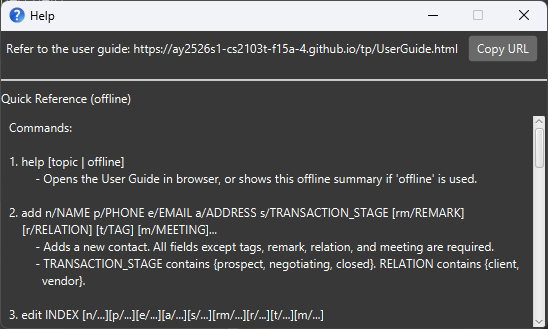
  <p style="text-align: center; margin-top: 4px;"><i>Offline Help window</i></p>
</div>

#### Help by topic: `help [TOPIC]`

**Format:** `help [TOPIC]`

**How it works:**
* `TOPIC` is optional and deep-links to a specific section of this guide.
* Topic matching is case-insensitive and ignores surrounding spaces.
* If the browser cannot be opened (e.g. blocked by the environment), a Help window will appear instead so you can copy the link manually.

**Supported topics:**  
`add`, `edit`, `delete`, `find`, `list`, `help`, `find a/`, `find t/`, `find r/`, `find s/`,  
`relation`, `transaction`, `archive`, `unarchive`, `remark`, `list meeting`, `clear`, and `exit`.

**Examples:**
* `help` → Opens the User Guide home.
* `help add` → Opens the “Adding a person” section.
* `help edit` → Opens the “Editing a person” section.

#### Help offline: `help offline`

**Format:** `help offline`

**How it works:**  
If you do not have internet access, you can manually open the Help window using the `help offline` command.  
This window provides a summary of all available commands and usage examples, allowing you to continue using Homey seamlessly while offline.

**Example:**
* `help offline` → Opens the offline Help window showing command summaries.
&nbsp;

&nbsp;

### Adding A Person: `add`

This is the core functionality of Homey that allows it to be your one-stop manager assistant, adding contacts.  
Use this feature whenever you want to add new contacts into Homey.

**Format:** `add n/NAME p/PHONE_NUMBER e/EMAIL a/ADDRESS s/TRANSACTION_STAGE [rm/REMARK] [r/RELATION] [t/TAG] [m/MEETING]…​`

**How it works:**  
Each contact will contain the following details:
* Name
* Phone number
* Email
* Address
* Relation: client or vendor
* Transaction stage: prospect, negotiating or closed
* [optional] Remark
* [optional] Tags
* [optional] Next meeting date & time in **YYYY-MM-DD HH:mm** `24-HOUR` format.

The relation and transaction stage fields help you as a property agent better manage and categorise your contacts.  
The meeting field allows you to log client appointments, property viewings, or consultations, helping you to stay organised.

If you forget to input any of the compulsory fields, the system will prompt you for the required inputs.  
To abort the command during this stage, input `cancel`.

<box type="tip" seamless>

**Tips:** 
* A person can have any number of tags (including 0).
* The s/TRANSACTION_STAGE field only accepts the values `prospect`, `negotiating` or `closed`.
* The r/RELATION field only accepts the values `client` or `vendor`.
* The m/MEETING field is optional - use it to record a future meeting date and time (e.g. 2025-11-03 14:00).
* The r/RELATION field is optional. The default relation for a new contact is client.
* The rm/REMARK field is optional - use it to add additional details regarding the person.
The remark field will be empty if no remark is given.
</box>

**Examples:**
* `add n/Jade Lim p/87438807 e/jade@ex.com a/Blk 30 s/prospect m/2025-11-03 14:00 rm/Likes nature`  
  &nbsp;
<div style="display: inline-block; text-align: center;">
  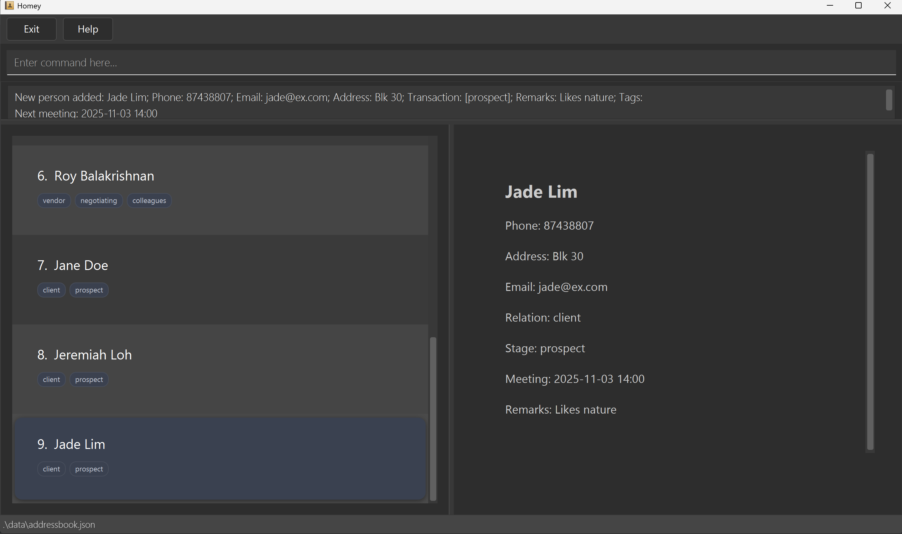
  <p style="text-align: center; margin-top: 4px;"><i>Added Jade Lim as contact</i></p>
</div>
&nbsp;

* `add n/John Doe p/98765432 e/johnd@example.com a/John street, block 123, #01-01 s/prospect`
&nbsp;
<div style="display: inline-block; text-align: center;">
  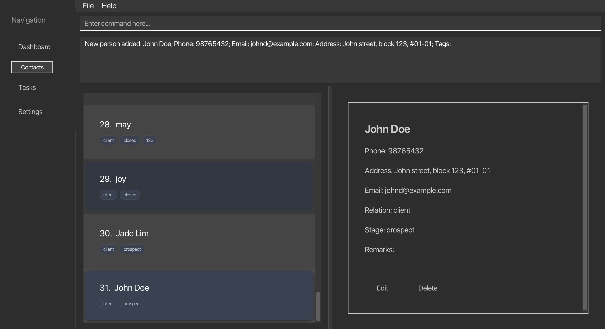
  <p style="text-align: center; margin-top: 4px;"><i>Added John Doe as contact</i></p>
</div>
&nbsp;

* `add n/Betsy Crowe t/friend e/betsycrowe@example.com a/Newgate Prison p/1234567 s/negotiating t/criminal`
&nbsp;
<div style="display: inline-block; text-align: center;">
  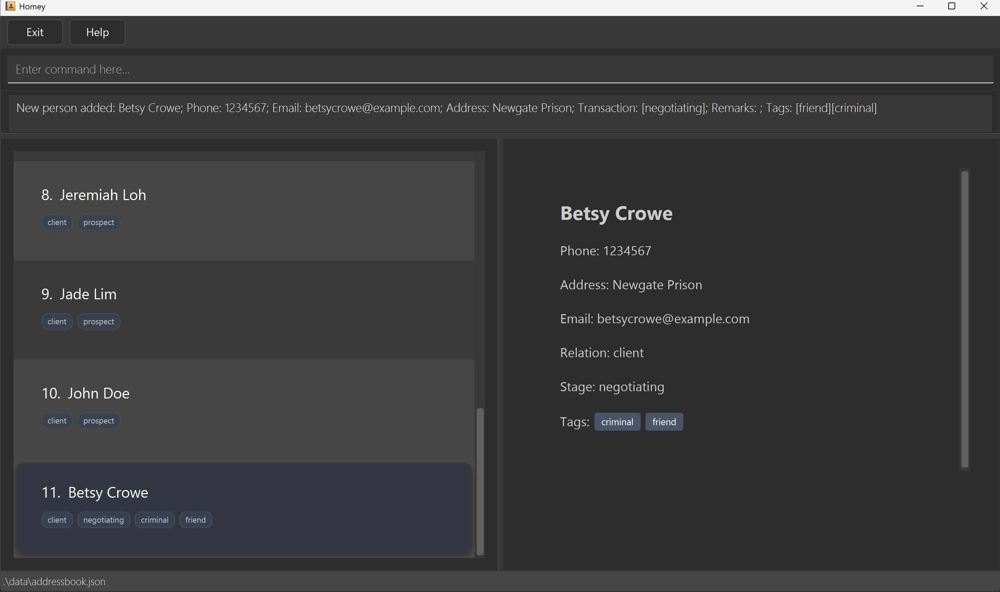
  <p style="text-align: center; margin-top: 4px;"><i>Added Betsy Crowe as contact</i></p>
</div>
&nbsp;

* `add n/Jeremiah Loh e/jloh@example.com a/Loh Street s/prospect`
  * Prompts for phone number input  
&nbsp;
<div style="display: inline-block; text-align: center;">
  
  <p style="text-align: center; margin-top: 4px;"><i>Prompt for phone number</i></p>
</div>
&nbsp;

#### Adding a meeting while creating a contact: `add`

You can include a meeting date and time when adding a new contact. This allows you to log client appointments, property viewings, or consultations right from the start — helping you stay organised and save time.

**Format:** `add n/NAME p/PHONE e/EMAIL a/ADDRESS s/STAGE m/MEETING_DATETIME`

**How it works:**
* Adds a new contact together with a scheduled meeting.
* `MEETING_DATETIME` must follow **YYYY-MM-DD HH:mm** in `24-HOUR` format.  
  Example: `2025-11-03 14:00` (3 Nov 2025, 2:00 PM)
* You can omit the `m/` prefix if the contact does not have a scheduled meeting.
* Click on the contact after adding to reveal the contact card with full information on the right panel.

**Example:**
* `add n/Kevin Tan p/87438807 e/jade@ex.com a/Blk 30 s/prospect m/2025-11-03 14:00`
  * Adds a new contact with a scheduled meeting on `3 Nov 2025, 2:00 PM`.
&nbsp;
<div style="display: inline-block; text-align: center;">
  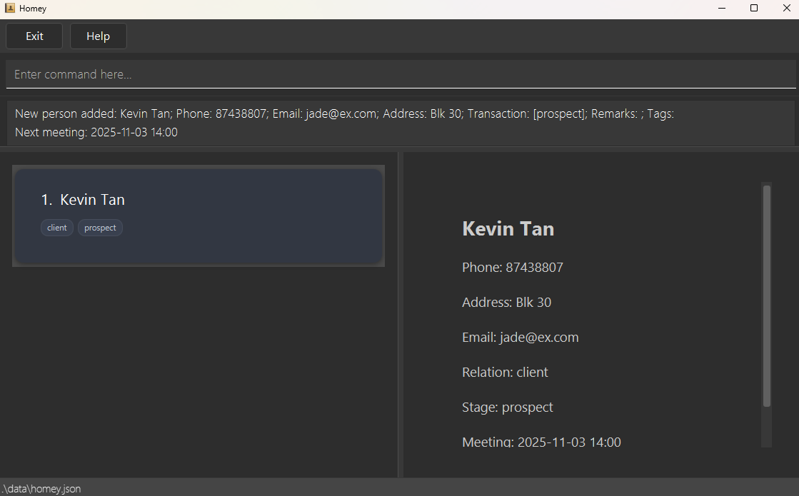
  <p style="text-align: center; margin-top: 4px;"><i>Added a contact Kevin with a scheduled meeting</i></p>
</div>
&nbsp;

## Listing your contacts

Homey lets you view all current contacts and get a clear overview of who you’re working with.

**General list behaviour:**

* **Active list view:** Only shows contacts that are not archived.

* **Reset view:** Clears any filters or search results (e.g., find, list meeting) and returns to the main contact list.

* **Instant update:** Any recent additions, edits, or deletions are immediately reflected in the displayed list.

* **Contact interaction:** Clicking on a contact opens its detailed information card on the right panel.

### Listing all contacts : `list`

Displays all active contacts currently in your address book. Use this command when you want to return to the full contact view after performing filters or searches.

**General behaviour:**
- **Case-insensitive:** Uppercase and lowercase letters are treated the same - typing `mEeTIng` will match `meeting` (does not apply to the command `list`).

#### List all contacts: `list`

Format: `list`

**How it works:** 
* Shows all active (non-archived) contacts stored in Homey.
* Ignores any extra spaces but not additional parameters unless specified in other commands.
* Contacts are displayed in the order they were added.
* Resets any previous filters, searches, or meeting-based listings.

**Example:**
* `list` 
  * Shows all contacts in homey.
&nbsp;
<div style="display: inline-block; text-align: center;">
  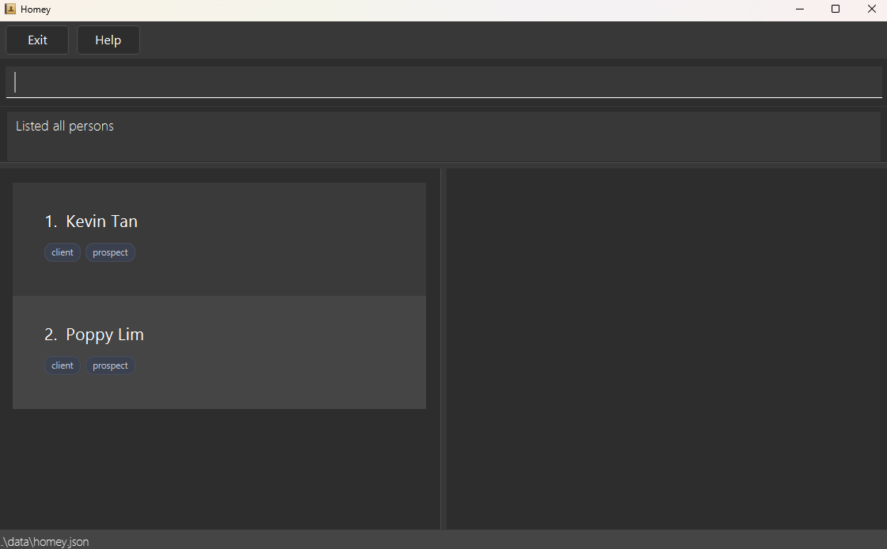
  <p style="text-align: center; margin-top: 4px;"><i>Listed all contacts</i></p>
</div>
&nbsp;

#### Listing contacts by meeting date : `list meeting`

This command help you to display all contacts with meetings, sorted by the **earliest meeting first**.

**Format:**  
`list meeting`

**How it works:**
* Displays only contacts with meetings, arranged from the nearest to the latest meeting.
* `meeting` is case-insensitive. e.g `Meeting` will match `meeting` and both will work.
* Contacts without meetings or that are archived will not be shown.
* If date and time are equal, it will sort by name in `alphabetical order`.
* If no contacts have meetings, Homey will display a clear message: `No contacts with meetings found.`
* Click on the contact to reveal the contact card with full information on the right panel.

**Example:**
* `list meeting` 
  * Shows all contacts with meetings in `ascending order` of date and time.
&nbsp;
<div style="display: inline-block; text-align: center;">
  
  <p style="text-align: center; margin-top: 4px;"><i>Listed contacts with meeting</i></p>
</div>

#### Listing archived contacts: `list archived` / `list archive`

After archiving, you can view all hidden contacts using the `list archived` or `list archive` command.

**Format:** `list archived` or `list archive`

**How it works:**
* Displays all contacts that have been archived.
* You can use `unarchive INDEX` to move them back into the active list.
* The list view switches automatically to the archived list when the command is entered.

**Example:**
* `list archived` shows the archived contacts.
  &nbsp;
<div style="display: inline-block; text-align: center;">
  
  <p style="text-align: center; margin-top: 4px;"><i>Alexandra's contact is moved to the archive list</i></p>
</div>

#### Listing active contacts: `list` / `list active`

After archiving, you can view all active contacts using the `list` or `list active` command.

**Format:** `list` or `list active`

**How it works:**
* Displays all contacts that are active (not archived).
* The list view switches automatically to the active list when the command is entered.

**Example:**
* `list active` shows the active contacts.
  &nbsp;
<div style="display: inline-block; text-align: center;">
  
  <p style="text-align: center; margin-top: 4px;"><i>Shows the active list of contacts</i></p>
</div>
&nbsp;

&nbsp;

## Editing A Person's Information

Homey lets you update existing contact details such as phone number, address, transaction stage, relation, remark, or meeting — all in one simple command.

**General editing behaviours:**

* **Automatic data validation:** Homey checks every edited field for valid format (e.g. phone, email, meeting date/time) before applying changes.

* **Partial updates:** You can edit one or multiple fields at once. Unspecified fields remain unchanged.

* **Conflict prevention:** Duplicate contacts are not allowed — Homey ensures edited entries do not match existing records.

### Editing a person: `edit`

Keeps your contact information up to date by editing an existing person’s details.

Format: `edit INDEX [n/NAME] [p/PHONE] [e/EMAIL] [a/ADDRESS] [s/TRANSACTION_STAGE] [rm/REMARK] [t/TAG] [m/MEETING]…​`

* Edits the person at the specified `INDEX`. The index refers to the index number shown in the displayed person list. The index **must be a positive integer** 1, 2, 3, …​
* At least one of the optional fields must be provided.
* Existing values will be updated to the input values.
* When editing tags, the existing tags of the person will be removed i.e. adding of tags is not cumulative.
* You can remove all the person’s tags by typing `t/` without
    specifying any tags after it.
* You can remove all the person’s remarks by typing `rm/` without
  specifying any remarks after it.

**Examples:**
* `edit 1 p/91234567 e/johndoe@example.com`
  * Edits the phone number and email address of the `1st` person to be `91234567` and `johndoe@example.com` respectively.
  &nbsp;
<div style="display: inline-block; text-align: center;">
  
  <p style="text-align: center; margin-top: 4px;"><i>Edited the first person's phone number and email address</i></p>
</div>

* `edit 2 n/Betsy Crower t/`
  * Edits the name of the `2nd` person to be `Betsy Crower` and clears all existing tags.
  &nbsp;
<div style="display: inline-block; text-align: center;">
  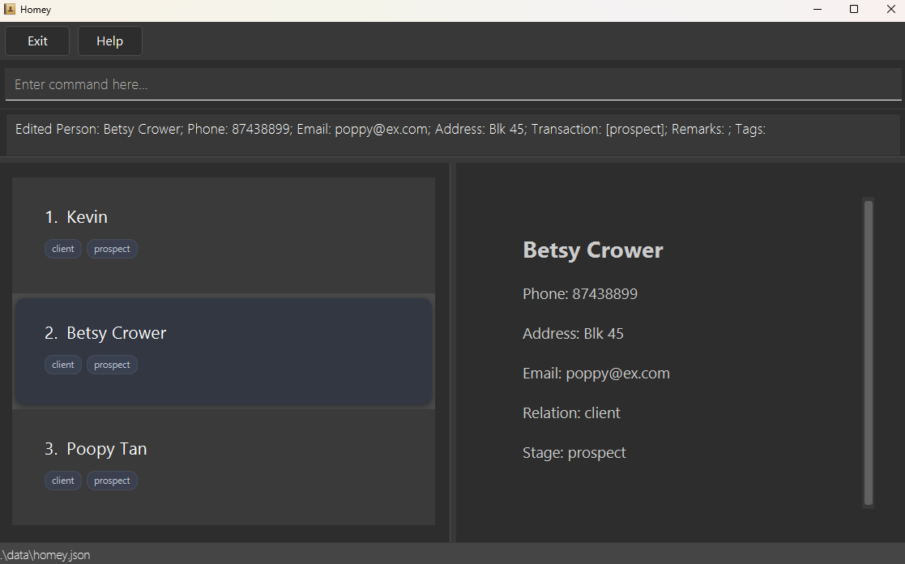
  <p style="text-align: center; margin-top: 4px;"><i>Edited the second person's name and clear all tags</i></p>
</div>
&nbsp;

#### Editing or removing a contact’s meeting : `edit INDEX m/`

You can update or remove a contact’s meeting date and time to reschedule appointments or clear meetings that are no longer needed.

**Format:**  
`edit INDEX m/MEETING_DATETIME`

**How it works:**
* Use the contact’s `index` as shown in the contact list.
* `MEETING_DATETIME` must follow **YYYY-MM-DD HH:mm** in `24-HOUR` format.
* To remove a meeting, leave the `m/` field empty.
* When a meeting is edited, Homey immediately updates the meeting time in both the contact card and meeting list.
* When a meeting is removed, Homey will clear it and show a confirmation message `Meeting cleared for Kevin Tan`
* This command can only modify the meeting field — other fields like name or transaction stage must be edited separately.
* Click on the contact to reveal the contact card with full information on the right panel.

**Examples:**
* `edit 1 m/2025-11-10 09:30` 
  * Updates the `1st` contact’s meeting to the specified date and time.
&nbsp;
<div style="display: inline-block; text-align: center;">
  
  <p style="text-align: center; margin-top: 4px;"><i>Updated Kevin's meeting</i></p>
</div>

* `edit 2 m/` 
  * Clears the meeting for the `2nd` contact.
&nbsp;
<div style="display: inline-block; text-align: center;">
  
  <p style="text-align: center; margin-top: 4px;"><i>Cleared a meeting for Poppy Lim</i></p>
</div>
&nbsp;

### Add relational tag : `relation`

Adds a relational tag to an existing contact in the address book. Use this command to edit the relation of a existing contact.

**Format:**
`relation INDEX RELATION`

**How it works:**
* Adds the specified relational tag to the person at the specified `INDEX`. The index refers to the index number shown in the displayed person list. The index **must be a positive integer** 1, 2, 3, …​
* The specified `RELATION` must be a valid relation: 'client' or 'vendor'.
* Existing values will be updated to the input values.

**Examples:**
*  `relation 2 client` Edits the relational tag of the 2nd person to be `client`.
&nbsp;
<div style="display: inline-block; text-align: center;">
  
  <p style="text-align: center; margin-top: 4px;"><i>Updated Bernice's relation</i></p>
</div>
&nbsp;

*  `relation 1 vendor` Edits the relational tag of the 1st person to be `vendor`.

### Tracking Deal Progress

Homey helps you easily track a contact's deal progress.
You can use the `transaction` command to mark where each deal currently stands, from early lead to closed sale.

**General behaviour:**
- **Stage-based tracking:** Each contact has a single transaction stage tag that shows their current deal 
progress.
- **Always present:** You cannot remove a transaction stage tag — a partner must always have one.
- **Defined stages:** Valid stages are `prospect`, `negotiating`, and `closed`.
- **Instant updates:** When you change the stage, the partner's tag updates immediately.

#### Updating the transaction stage: `transaction INDEX s/TRANSACTION_STAGE`

You can update a contact’s deal progress by replacing their current transaction stage. This is useful when a deal moves
forward or changes status, helping you maintain an accurate overview of your active deals.

**Format:** `transaction INDEX s/TRANSACTION STAGE`

**How it works:**
* Replaces the transaction stage of the contact at the specified `INDEX` to `TRANSACTION STAGE`.
* The given `TRANSACTION STAGE` must be one of the following: `prospect`, `negotiating` or `closed`.
* `TRANSACTION STAGE` is case-insensitive — e.g. `prOsPECT` works the same as `prospect`
* Additional whitespace is accepted — e.g. `s/   closed` works the same as `s/closed`

**Examples:**
* `transaction 1 s/prospect`
  * Replaces the transaction stage tag of the 1st contact to be `prospect`.
&nbsp;
<div style="display: inline-block; text-align: center;">
  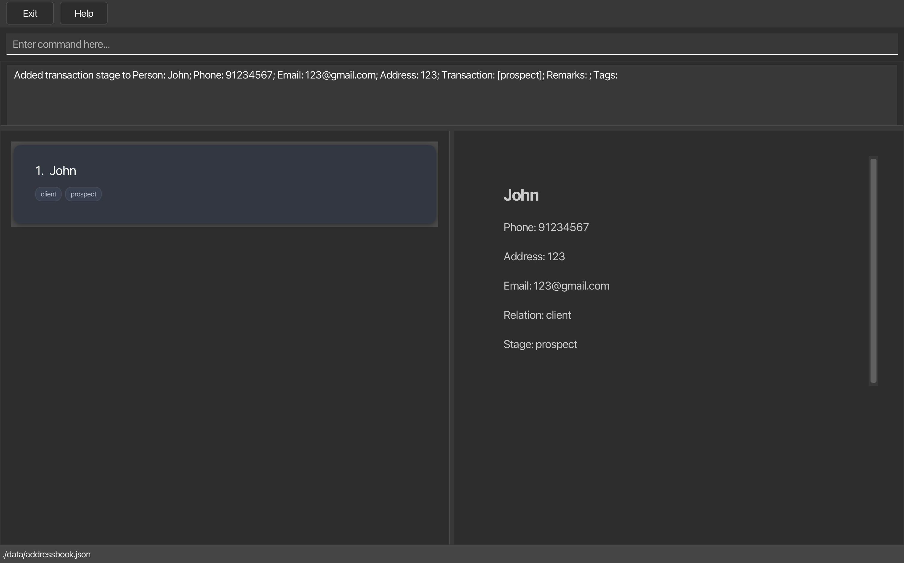
  <p style="text-align: center; margin-top: 4px;"><i>Changed John's transaction stage to "prospect"</i></p>
</div>

* `transaction 1 s/NEGOTIATING` 
  * Replaces the transaction stage tag of the 1st contact to be `negotiating`.
&nbsp;
<div style="display: inline-block; text-align: center;">
  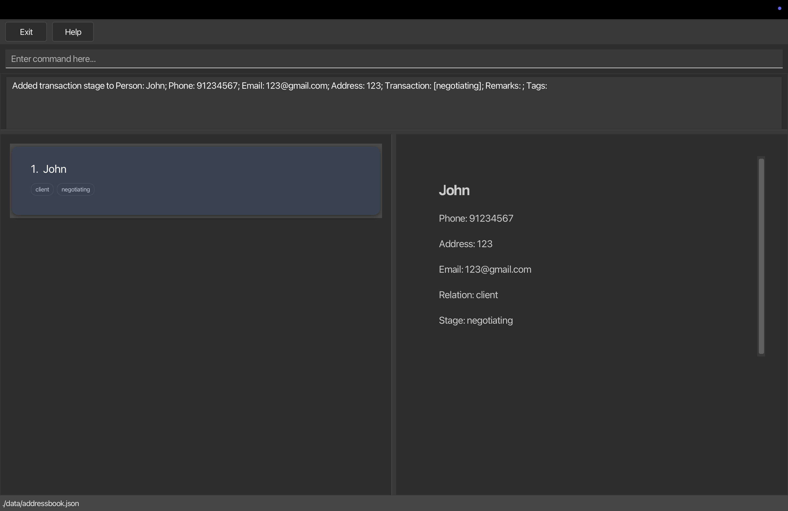
  <p style="text-align: center; margin-top: 4px;"><i>Changed John's transaction stage to "negotiating"</i></p>
</div>
&nbsp;

### Adding Remarks 

Homey lets you effortlessly record notes about each contact for quick reference.
You can use the `remark` command to add, update or remove personal notes such as preferences, reminders or follow-ups.

**General behaviour:**
- **Flexible usage:** You can add, edit, or delete remarks for any contact.
- **Instant updates:** Changes appear immediately on the partner’s profile.
- **Hidden by default:** The `remark` field only appears after a remark has been added.

#### Adding or editing a remark: `remark INDEX rm/REMARK`

You can add a new remark or update an existing one for the selected contact to capture important details and
stay organized.

**Format:** `remark INDEX rm/REMARK`

**How it works:**
* You can replace the existing remark of the contact at the specified `INDEX` with the given `REMARK`.
* If the partner at `INDEX` does not have a remark, the new `REMARK` will be added.
* If you leave `REMARK` empty (e.g. `remark 1 rm/`), the remark will be removed.
* Extra spaces around `rm/` are ignored — e.g. `rm/   Has pets` works the same as `rm/Has pets`

**Examples:**
* `remark 1 rm/Likes nature` 
  * Replaces the remark of the 1st contact to be "Likes nature".
&nbsp;
<div style="display: inline-block; text-align: center;">
  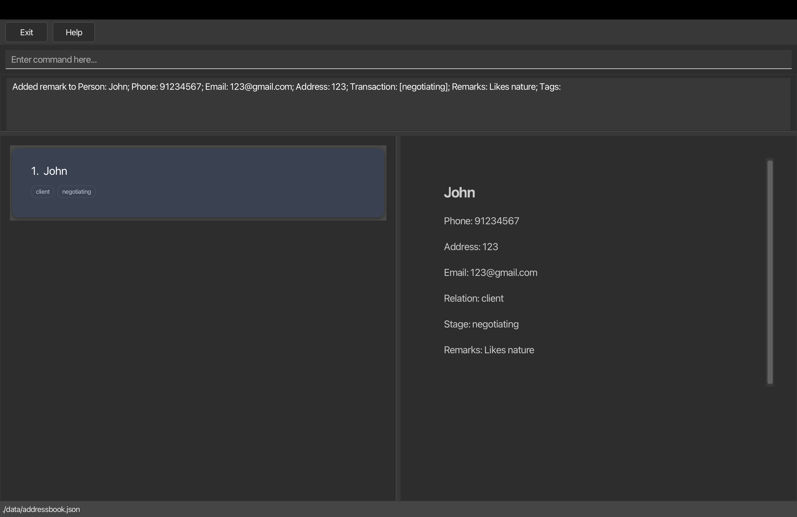
  <p style="text-align: center; margin-top: 4px;"><i>Updated John's remark</i></p>
</div>

* `remark 1 rm/` 
  * Removes the remark of the 1st contact.
    &nbsp;
<div style="display: inline-block; text-align: center;">
  
  <p style="text-align: center; margin-top: 4px;"><i>Removed John's remark</i></p>
</div>
&nbsp;

### Finding Your Contacts

Homey helps you quickly locate any contact in your property database. You can search using `find` command with different filters to match your workflow needs.

**General search rules** (applies to name, address, and tag searches):
- **Case-insensitive:** Uppercase and lowercase letters are treated the same - typing `john` will match `John`
- **Partial matching:** You do not have to type the full word - typing `Han` will find `Hans`
- **Multiple keywords:** Use spaces between words to search for multiple terms at once
- **Order does not matter:** Keywords can be in any order - `Doe John` will match `John Doe`

#### Find by name: `find`

You can search for contacts whose names contain keywords you specify. This is useful when you remember a contact's name but need to pull up their full details quickly.

**Format:** `find KEYWORD [MORE_KEYWORDS]`

**How it works:**
* Only the contact names are searched
* All general search rules apply: case-insensitive matching, partial matching, multiple keywords, and flexible keyword order

Examples:
* `find John` returns `john` and `John Doe`
* `find ale` returns `Alex Yeoh` and `Alexandra Tan`<br>
<div style="display: inline-block; text-align: center;">
  
  <p style="text-align: center; margin-top: 4px;"><i>Displays contacts whose names contain 'ale'</i></p>
</div>

* `find john alex` returns `Alex Yeoh`, `John Doe`, `Alexandra Tan`, `John Elks` <br>
<div style="display: inline-block; text-align: center;">
  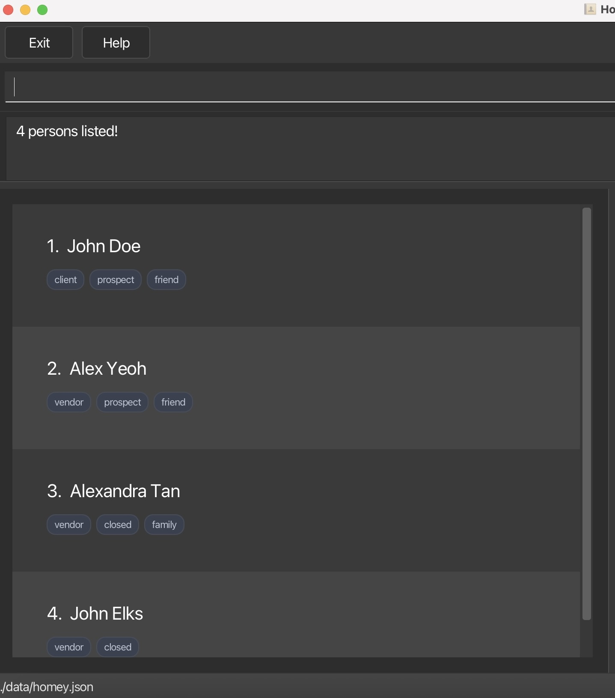
  <p style="text-align: center; margin-top: 4px;"><i>Displays contacts whose names contain 'john' or 'alex'</i></p>
</div>

#### Find by address: `find a/`

You can search for contacts based on their address. This is particularly useful when you are managing properties in specific neighbourhoods or planing site visits in the same area.

**Format:** `find a/KEYWORD [MORE_KEYWORDS]`

**How it works:**
* Only the address field is searched
* All general search rules apply: case-insensitive matching, partial matching, multiple keywords, and flexible keyword order

Examples:
* `find a/Bedok` returns all persons living in `Bedok`
* `find a/hou` returns all persons living in `hougang` and `Hougang` <br>
<div style="display: inline-block; text-align: center;">
  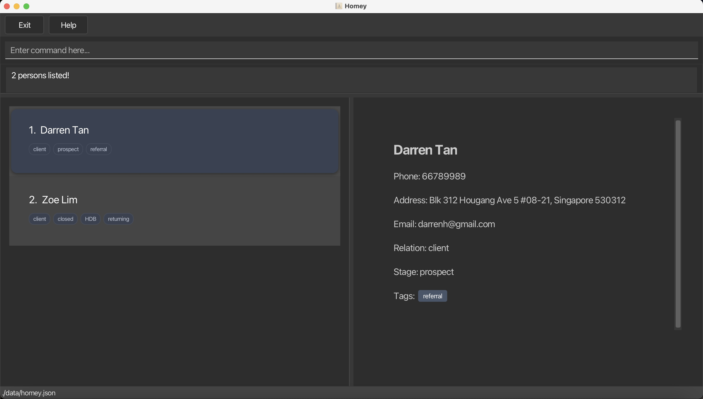
  <p style="text-align: center; margin-top: 4px;"><i>Displays contacts whose addresses contain Hougang</i></p>
</div>

#### Find by tag: `find t/`

You can search for contacts with specific tags you have assigned them. Tags help you organise contacts by categories like `referral`, `firsttimebuyer` or `investor` and many more.

**Format:** `find t/KEYWORD [MORE_KEYWORDS]`

**How it works:**
* Only the tag field is searched 
* All general search rules apply: case-insensitive matching, partial matching, multiple keywords, and flexible keyword order

Examples:
* `find t/condo` returns all persons tagged with `condo`
* `find t/bu` returns all persons with tags containing `bu` (e.g., `firsttimebuyer`, `budget`)
* `find t/buyer budget` returns persons tagged with either `buyer` or `budget`<br>
<div style="display: inline-block; text-align: center;">
  
  <p style="text-align: center; margin-top: 4px;"><i>Displays contacts whose tags contain 'bu'</i></p>
</div>

#### Find by relation: `find r/`

You can filter your contacts by whether they are property sellers or buyers. This helps you quickly segment your contact list when you need to contact all vendors about new listings or reach out to clients looking for properties.

**Format:** `find r/RELATION`

**How it works:**
* Only the relation field is searched
* You must type the exact relation type - partial words like `ven` will not work
* You can only search for one relation at a time
* Case-insensitive matching applies - `VENDOR`, `Vendor` and `vendor` all work

**Available relations:**
* `vendor`
* `client`

Examples:
* `find r/vendor` returns all persons with relation `vendor`
* `find r/client` returns all persons with relation `client`<br>
<div style="display: inline-block; text-align: center;">
  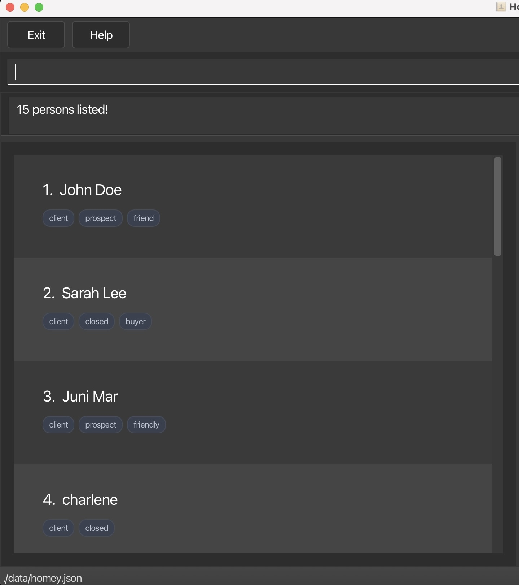
  <p style="text-align: center; margin-top: 4px;"><i>Displays contacts whose relation is client</i></p>
</div>

#### Find by transaction stage: `find s/`

You can filter contacts based on where they are in your sales pipeline. This helps you prioritise follow-ups, whether you need to check in with active negotiations or reconnect with potential clients.

**Format:** `find s/STAGE`

**How it works:**
* Only the transaction field is searched
* You must type the exact stage name - partial words like `pros` will not work
* You can only search for one stage at a time
* Case-insensitive matching applies - `Prospect`, `PROSPECT` and `prospect` all work

**Available stages:**
* `prospect`
* `negotiating`
* `closed`

Examples:
* `find s/prospect` returns all persons with transaction stage `prospect`
* `find s/negotiating` returns all persons with transaction stage `negotiating`
* `find s/closed` returns all persons with transaction stage `closed`<br>
<div style="display: inline-block; text-align: center;">
  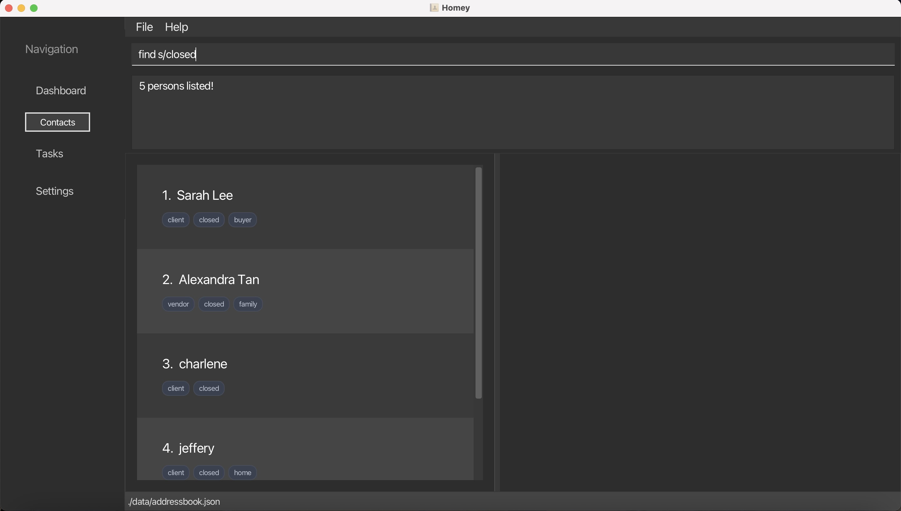
  <p style="text-align: center; margin-top: 4px;"><i>Displays contacts whose transaction stage is closed</i></p>
</div>

&nbsp;

&nbsp;

### Archiving Your Contacts: `archive`

Homey lets you move a contact from the **active list** to the **archived list**, keeping your workspace organised without losing any information. Use this feature when you want to temporarily hide a contact instead of deleting them.

**General archiving behaviour:**
- **Hidden but retained:** Archived contacts are removed from the active list but remain stored in the system.
- **Viewable on demand:** You can view archived contacts using the `list archived` or `list archive` command.
- **Restoration available:** Use the `unarchive INDEX` command to move a contact back to the active list.

You can archive a contact by specifying their index in the currently displayed list.

**Format:** `archive INDEX`

**How it works:**
* Archives the person at the specified `INDEX` (as shown in the current list).
* The index must be a positive integer - e.g. `1`, `2`, `3`, ...
* Only works when viewing the **active list** (i.e. after using `list`).
* Once archived, the person will no longer appear in the active contact list.

**Example:**
* `archive 2` archives the 2nd person in the active list.
&nbsp;
<div style="display: inline-block; text-align: center;">
  
  <p style="text-align: center; margin-top: 4px;"><i>Archived Alexandra's contact</i></p>
</div>
&nbsp;

&nbsp;

### Unarchiving Your Contacts: `unarchive`

You can restore a contact from the **archived list** back to the **active list**, allowing you to re-engage with previously hidden contacts.

**General unarchiving behaviour:**
- **Restores visibility:** Moves the selected contact from the archived list back to the active list.
- **Active list only:** Once unarchived, the person immediately reappears in the active list.
- **Archived list restricted:** The command only works when viewing the **archived list** (i.e. after using `list archived`).
- **View restored contacts:** Use `list active` or `list` to see the restored contact in your main view.

You can unarchive a contact by specifying their index in the currently displayed archived list.

**Format:** `unarchive INDEX`

**How it works:**
* Unarchives the person at the specified `INDEX` (as shown in the archived list).
* The index must be a positive integer  e.g. `1`, `2`, `3`, ...
* Only works when viewing the **archived list**.
* The restored person will immediately return to the **active list**.

**Examples:**
* `unarchive 1` restores the 1st person in the archived list.
&nbsp;
<div style="display: inline-block; text-align: center;">
  
  <p style="text-align: center; margin-top: 4px;"><i>Unarchived 1st contact in the archive list</i></p>
</div>
&nbsp;

<div style="display: inline-block; text-align: center;">
  
  <p style="text-align: center; margin-top: 4px;"><i>Contact returns to the active list</i></p>
</div>
&nbsp;

&nbsp;

### Deleting a person : `delete`

You can remove a contact from Homey permanently. This is useful when you no longer need to maintain a record of a particular client or vendor.

**Format:** `delete INDEX`

**How it works:**
* You must specify the index number shown in the displayed contact list
* The index must be a positive integer: 1,2,3, and so on
* The contact at the specified index will be permanently deleted

Examples:
* `list` followed by `delete 2` deletes the 2nd person in the address book.
* `find James` followed by `delete 1` deletes the 1st person in the results of the `find` command.
<div style="display: inline-block; text-align: center;">
  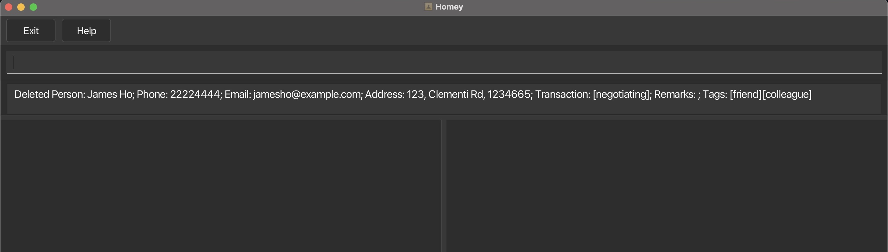
  <p style="text-align: center; margin-top: 4px;"><i>James Ho is deleted from Homey</i></p>
</div>
&nbsp;

&nbsp;

### Clearing all entries : `clear`

You can remove all contacts from Homey at once. This is useful when you want to start fresh with a completely empty contact list.

**Format:** `clear`

**How it works:**
* All contacts in your address book will be permanently deleted
* This removes all contacts, not just the ones currently shown on your screen
&nbsp;

&nbsp;

### Exiting the program : `exit`

You can close the Homey application safely. All your information is automatically saved before the program exits.

**Format:** `exit`

**How it works:**
* The application window will close
* All changes you made during your session are saved automatically
* You can reopen Homey anytime to access your saved contacts
&nbsp;

&nbsp;

### Saving the data

Homey automatically saves all contact data (including meetings, remarks, relations, and transaction stages) to your hard disk after every command that changes the data.  
There is no need to save manually — your latest updates are always preserved.

### Editing the data file

Homey data are saved automatically as a JSON file `[JAR file location]/data/homey.json`. Advanced users are welcome to update data directly by editing that data file.

<box type="warning" seamless>

**Caution:**
If your changes to the data file makes its format invalid, Homey will discard all data and start with an empty data file at the next run.  Hence, it is recommended to take a backup of the file before editing it.<br>
Furthermore, certain edits can cause Homey to behave in unexpected ways (e.g., if a value entered is outside the acceptable range). Therefore, edit the data file only if you are confident that you can update it correctly.
</box>

--------------------------------------------------------------------------------------------------------------------

## FAQ

**Q**: How do I transfer my data to another Computer?<br>
**A**: Install the app in the other computer and overwrite the empty data file it creates with the file that contains the data of your previous AddressBook home folder.

--------------------------------------------------------------------------------------------------------------------

## Known issues

1. **When using multiple screens**, if you move the application to a secondary screen, and later switch to using only the primary screen, the GUI will open off-screen. The remedy is to delete the `preferences.json` file created by the application before running the application again.
2. **If the Help window is shown** (e.g. when your system blocks opening the browser) and you **minimize it**, running the `help` command (or use the `Help` menu, or the keyboard shortcut `F1`) again will not restore it automatically. The remedy is to manually restore the minimized Help Window.

--------------------------------------------------------------------------------------------------------------------

## Command summary

| Action          | Format, Examples                                                                                                                                                                                                                      |
|-----------------|---------------------------------------------------------------------------------------------------------------------------------------------------------------------------------------------------------------------------------------|
| **Add**         | `add n/NAME p/PHONE_NUMBER e/EMAIL a/ADDRESS s/TRANSACTION_STAGE [r/RELATION] [t/TAG] [m/MEETING]…​` <br> e.g., `add n/James Ho p/22224444 e/jamesho@example.com a/123, Clementi Rd, 1234665 t/friend t/colleague m/2025-10-10 09:30` |
| **Clear**       | `clear`                                                                                                                                                                                                                               |
| **Delete**      | `delete INDEX`<br> e.g., `delete 3`                                                                                                                                                                                                   |
| **Edit**        | `edit INDEX [n/NAME] [p/PHONE_NUMBER] [e/EMAIL] [a/ADDRESS] [s/TRANSACTION_STAGE] [t/TAG] [m/MEETING]…​`<br> e.g.,`edit 2 n/James Lee e/jameslee@example.com`, `edit 3 m/2025-10-10 09:30`                                            |
| **Relation**    | `relation INDEX RELATION` <br> e.g., `relation 1 vendor`                                                                                                                                                                              |
| **Transaction** | `transaction INDEX s/TRANSACTION_STAGE` <br> e.g., `transaction 1 s/prospect`                                                                                                                                                         |
| **Remark**      | `remark INDEX rm/REMARK` <br> e.g., `remark 1 rm/Likes nature`                                                                                                                                                                        
| **Find**        | `find KEYWORD [MORE_KEYWORDS]`<br> e.g., `find James Jake`                                                                                                                                                                            |
| **Find a/**     | `find a/KEYWORD [MORE_KEYWORDS]`<br> e.g., `find Bedok`                                                                                                                                                                               |
| **Find t/**     | `find t/KEYWORD [MORE_KEYWORDS]`<br> e.g., `find t/friend`                                                                                                                                                                            |
| **Find r/**     | `find r/RELATION`<br> e.g., `find r/client`                                                                                                                                                                                           |
| **Find s/**     | `find s/TRANSACTION_STAGE`<br> e.g., `find s/negotiating`                                                                                                                                                                             |
| **List**        | `list [archive]` <br> e.g., `list`, `list archive`, `list meeting`                                                                                                                                                                                   |
| **Help**        | `help [TOPIC]`<br> e.g., `help add`<br><br>`help offline`                                                                                                                                                                             |
| **Archive**     | `archive INDEX`<br> e.g., `archive 1`                                                                                                                                                                                                 |
| **Unarchive**   | `unarchive INDEX`<br> e.g., `unarchive 1`                                                                                                                                                                                             |
