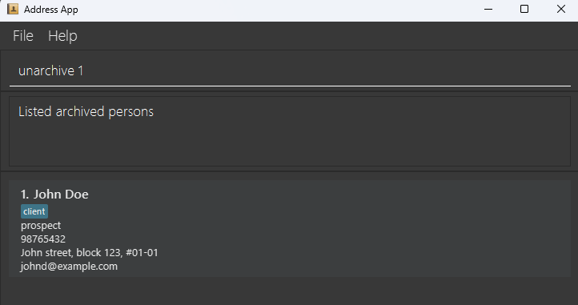

# Homey User Guide

Homey is a **desktop app for property agents** to manage clients, meetings, and transactions - all in one place.

It combines the **speed of a Command Line Interface (CLI)** with the **simplicity of a Graphical User Interface (GUI)**, so you can work quickly while staying organised.

With Homey, you can:
* Categorise contacts as *clients* or *vendors*
* Track deal progress through *transaction stages*
* Schedule and view *meetings* directly

Whether you're closing deals or managing follow-ups, Homey helps you stay on top of your work - faster and smarter.

<!-- * Table of Contents -->
<page-nav-print />

--------------------------------------------------------------------------------------------------------------------

## Quick start

1. To ensure you have Java `17` or above installed in your Computer: 
   * Search for Command Prompt in the Start Menu (if you are using Mac, open terminal by using Spotlight Search (Command + Space bar), then type "Terminal").
     
   * Enter `java -version` and press Enter. You should see something like this.
     
   * Verify that the terminal displays `java version "17"` or higher (highlighted line in screenshot above). 
   * if Java version displayed is not Java `17` or higher:
     * **Windows users:** Ensure you have the precise JDK version prescribed [here](https://se-education.org/guides/tutorials/javaInstallationWindows.html).
     * **Mac users:** Ensure you have the precise JDK version prescribed [here](https://se-education.org/guides/tutorials/javaInstallationMac.html).

2. Download the latest `.jar` file from [here](https://github.com/AY2526S1-CS2103T-F15A-4/tp/releases/).

3. Copy the file to the folder you want to use as the _home folder_ for your AddressBook.

4. Open the command terminal (as in Step 1), and change directory using the command `cd` into the folder you put the jar file in. 
   
   <box type="tip" seamless>
   **Tip:**
   If your home folder is in your desktop, make sure you change directory to your desktop first as shown in the screenshot. 
   For example, we change directory to the `Desktop` first, before changing it to the folder `your_home_folder_name` where our jar file is in.
   </box>

5. Use the `java -jar homey.jar` command and press Enter to run the application. 
   

6. A GUI similar to the below should appear in a few seconds. Note how the app contains some sample data. 
   

7. Type a command in the command box and press Enter to execute it. e.g. typing **`help`** and pressing Enter will open the User Guide in your web browser (if the browser can’t be opened, a Help window will appear instead). 
   Some example commands you can try:

   * `list` : Lists all contacts.

   * `add n/John Doe p/98765432 e/johnd@example.com a/John street, block 123, #01-01 s/prospect` : Adds a contact named `John Doe` to the Address Book.

   * `delete 3` : Deletes the 3rd contact shown in the current list.

   * `clear` : Deletes all contacts.

   * `exit` : Exits the app.

8. Refer to the [Features](#features) below for details of each command.

--------------------------------------------------------------------------------------------------------------------

## Features

<box type="info" seamless>

**Notes about the command format:** 

* Words in `UPPER_CASE` are the parameters to be supplied by the user. 
  e.g. in `add n/NAME`, `NAME` is a parameter which can be used as `add n/John Doe`.

* Items in square brackets are optional. 
  e.g `n/NAME [t/TAG]` can be used as `n/John Doe t/friend` or as `n/John Doe`.

* Items with `…`​ after them can be used multiple times including zero times. 
  e.g. `[t/TAG]…​` can be used as ` ` (i.e. 0 times), `t/friend`, `t/friend t/family` etc.

* Parameters can be in any order. 
  e.g. if the command specifies `n/NAME p/PHONE_NUMBER`, `p/PHONE_NUMBER n/NAME` is also acceptable.

* Extraneous parameters for commands that do not take in parameters (such as `list`, `exit` and `clear`) will be ignored. 
  e.g. if the command specifies `list 123`, it will be interpreted as `list`.

* `help` accepts an optional topic to deep-link to a specific section of this guide.
  e.g. `help add`, `help edit` and `help delete`.

* If you are using a PDF version of this document, be careful when copying and pasting commands that span multiple lines as space characters surrounding line-breaks may be omitted when copied over to the application.
</box>

### Viewing help

Homey provides a built-in help feature to guide you through all available commands.  
If you're unsure about what to do, use the `help` command to open the User Guide directly in your browser.

**Generic behaviour:**
- **Online access:** When you enter a `help [topic]` command (e.g. `help add`), the browser automatically opens the relevant section of the User Guide.
  

- **Offline or blocked access:**  
  If the browser cannot be opened (e.g. blocked by the environment) or you do not have internet access, a Help window will appear instead.  
  You can also open this window manually using the `help offline` command.  
  This window provides a summary of all available commands and usage examples.  
  

#### Help by topic: `help [TOPIC]`

**Format:** `help [TOPIC]`

**How it works:**
* `TOPIC` is optional and deep-links to a specific section of this guide.
* Topic matching is case-insensitive and ignores surrounding spaces.
* If the browser cannot be opened (e.g. blocked by the environment), a Help window will appear instead so you can copy the link manually.

**Supported topics:**  
`add`, `edit`, `delete`, `find`, `list`, `help`, `find a/`, `find t/`, `find r/`, `find s/`,  
`relation`, `transaction`, `archive`, `unarchive`, `remark`, `list meeting`, `clear`, and `exit`.

**Examples:**
* `help` → Opens the User Guide home.
* `help add` → Opens the “Adding a person” section.
* `help edit` → Opens the “Editing a person” section.

#### Help offline: `help offline`

**Format:** `help offline`

**How it works:**  
If you do not have internet access, you can manually open the Help window using the `help offline` command.  
This window provides a summary of all available commands and usage examples, allowing you to continue using Homey seamlessly while offline.

**Example:**
* `help offline` → Opens the offline Help window showing command summaries.

&nbsp;

### Adding a person: `add`

Adds a person to the address book.

Format: `add n/NAME p/PHONE_NUMBER e/EMAIL a/ADDRESS s/TRANSACTION_STAGE [rm/REMARK] [r/RELATION] [t/TAG] [m/MEETING]…​`

If you forget to input any of the compulsory fields, the system will prompt you for the required inputs. 
To abort the command during this stage, input `cancel`.

<box type="tip" seamless>

**Tips:** 
* A person can have any number of tags (including 0).
* The s/TRANSACTION_STAGE field only accepts the values `prospect`, `negotiating` or `closed`.
* The r/RELATION field only accepts the values `client` or `vendor`.
* The m/MEETING field is optional - use it to record a future meeting date and time (e.g. 2025-11-03 14:00).
* The r/RELATION field is optional. The default relation for a new contact is client.
* The rm/REMARK field is optional - use it to add additional details regarding the person.
The remark field will be empty if no remark is given.
</box>

Examples:
* `add n/Jade Lim p/87438807 e/jade@ex.com a/Blk 30 s/prospect m/2025-11-03 14:00 rm/Likes nature`

* `add n/John Doe p/98765432 e/johnd@example.com a/John street, block 123, #01-01 s/prospect` 
  * Adds a person named John Doe whose phone number is `98765432`, email is `johnd@example.com`, address is
  `John street, block 123, #01-01`, relation is `client`, and transaction stage is `prospect`.
  
* `add n/Betsy Crowe t/friend e/betsycrowe@example.com a/Newgate Prison p/1234567 s/negotiating t/criminal`
  * Adds a person named Betsy Crowe whose phone number is `1234567`, email is `betsycrowe@example.com`, address is
  `Newgate Prison`, relation is `client`, transaction stage is `negotiating`, and is tagged as `criminal` and `friend`.
  
* `add n/Jeremiah Loh e/jloh@example.com a/Loh Street s/prospect`
  * Prompts for phone number input and adds a person with the specified phone number named Jeremiah Loh whose 
    email is jloh@example.com, address is Loh Street, relation is client and transaction stage is prospect.
  

&nbsp;

#### Adding a meeting while creating a contact: `add`

You can include a meeting date and time when adding a new contact. This allows you to log client appointments, property viewings, or consultations right from the start — helping you stay organised and save time.

**Format:** `add n/NAME p/PHONE e/EMAIL a/ADDRESS s/STAGE m/MEETING_DATETIME`

**How it works:**
* Adds a new contact together with a scheduled meeting.
* `MEETING_DATETIME` must follow **YYYY-MM-DD HH:mm** in `24-HOUR` format.  
  Example: `2025-11-03 14:00` (3 Nov 2025, 2:00 PM)
* You can omit the `m/` prefix if the contact does not have a scheduled meeting.
* Click on the contact after adding to reveal the contact card with full information on the right panel.

**Example:**
* `add n/Kevin Tan p/87438807 e/jade@ex.com a/Blk 30 s/prospect m/2025-11-03 14:00`
  * Adds a new contact with a scheduled meeting on `3 Nov 2025, 2:00 PM`.
&nbsp;

  
  
<i>Added a contact Kevin with a scheduled meeting</i>

&nbsp;

### Listing all contacts : `list`

Displays all active contacts currently in your address book.
Use this command when you want to return to the full contact view after performing filters or searches.

Format: `list`

**How it works:** 
* Shows all active (non-archived) contacts stored in Homey.
* Ignores any extra spaces but not additional parameters unless specified in other commands.
* Contacts are displayed in the order they were added.
* Resets any previous filters, searches, or meeting-based listings.

**Example:**
* `list` 
  * Shows all contacts in homey.
&nbsp;

  
  
<i>Listed all contacts</i>

&nbsp;

### Listing contacts by meeting date : `list meeting`

This command help you to display all contacts with meetings, sorted by the **earliest meeting first**.

**Format:**  
`list meeting`

**How it works:**
* Displays only contacts with meetings, arranged from the nearest to the latest meeting.
* `meeting` is case-insensitive. e.g `Meeting` will match `meeting` and both will work.
* Contacts without meetings or that are archived will not be shown.
* If date and time are equal, it will sort by name in `alphabetical order`.
* If no contacts have meetings, Homey will display a clear message: `No contacts with meetings found.`
* Click on the contact to reveal the contact card with full information on the right panel.

**Example:**
* `list meeting` 
  * Shows all contacts with meetings in `ascending order` of date and time.
&nbsp;

  
  
<i>Listed contacts with meeting</i>

&nbsp;

### Editing a person : `edit`

Edits an existing person in the address book.

Format: `edit INDEX [n/NAME] [p/PHONE] [e/EMAIL] [a/ADDRESS] [s/TRANSACTION_STAGE] [rm/REMARK] [t/TAG] [m/MEETING]…​`

* Edits the person at the specified `INDEX`. The index refers to the index number shown in the displayed person list. The index **must be a positive integer** 1, 2, 3, …​
* At least one of the optional fields must be provided.
* Existing values will be updated to the input values.
* When editing tags, the existing tags of the person will be removed i.e. adding of tags is not cumulative.
* You can remove all the person’s tags by typing `t/` without
    specifying any tags after it.

Examples:
*  `edit 1 p/91234567 e/johndoe@example.com` Edits the phone number and email address of the 1st person to be `91234567` and `johndoe@example.com` respectively.
*  `edit 2 n/Betsy Crower t/` Edits the name of the 2nd person to be `Betsy Crower` and clears all existing tags.
*  `edit 5 m/2025-11-10 09:30` Updates the 5th person’s next meeting to `10 Nov 2025 at 9:30 AM.`
*  `edit 5 m/` Clears the meeting time for the 5th person.

&nbsp;

#### Editing or removing a contact’s meeting : `edit`

You can update or remove a contact’s meeting date and time to reschedule appointments or clear meetings that are no longer needed.

**Format:**  
`edit INDEX m/MEETING_DATETIME`

**How it works:**
* Use the contact’s `index` as shown in the contact list.
* `MEETING_DATETIME` must follow **YYYY-MM-DD HH:mm** in `24-HOUR` format.
* To remove a meeting, leave the `m/` field empty.
* When a meeting is edited, Homey immediately updates the meeting time in both the contact card and meeting list.
* When a meeting is removed, Homey will clear it and show a confirmation message `Meeting cleared for Kevin Tan`
* This command can only modify the meeting field — other fields like name or transaction stage must be edited separately.
* Click on the contact to reveal the contact card with full information on the right panel.

**Examples:**
* `edit 1 m/2025-11-10 09:30` 
  * Updates the `1st` contact’s meeting to the specified date and time.
&nbsp;

  
  
<i>Updated Kevin's Meeting</i>

* `edit 2 m/` 
  * Clears the meeting for the `2nd` contact.
&nbsp;

  
  
<i>Cleared a meeting for Poppy Lim</i>

&nbsp;

### Add relational tag : `relation`

Adds a relational tag to an existing person in the address book.

Format: `relation INDEX RELATION`

* Adds the specified relational tag to the person at the specified `INDEX`. The index refers to the index number shown in the displayed person list. The index **must be a positive integer** 1, 2, 3, …​
* The specified `RELATION` must be a valid relation: 'client' or 'vendor'.
* Existing values will be updated to the input values.

Examples:
*  `relation 2 client` Edits the relational tag of the 2nd person to be `client`.
   
*  `relation 1 vendor` Edits the relational tag of the 1st person to be `vendor`.

### Changing the transaction stage : `transaction`

Replaces the transaction stage tag of an existing person to the given stage.

Format: `transaction INDEX s/TRANSACTION_STAGE`

* Replaces the transaction stage of the person at the specified `INDEX`.
* The given `TRANSACTION_STAGE` must be one of the following: `prospect`, `negotiating` or `closed`.
* Additional whitespace is accepted.
* `TRANSACTION_STAGE` is case-sensitive.
* The Transaction Stage tag cannot be removed, only replaced.

Examples:
* `transaction 32 s/prospect` Replaces the transaction stage tag of the 32nd person to be `prospect`.

* `transaction 32 s/negotiating` Replaces the transaction stage tag of the 32nd person to be `negotiating`.

* `transaction    32     s/  closed` Replaces the transaction stage tag of the 32nd person to be `closed`.

### Adding a remark: `remark`

Edits the remark of an existing person.

Format: `remark INDEX rm/REMARK`

* The remark of the person at `INDEX` is replaced with the given `REMARK`.
* If the person at `INDEX` does not have a remark, the given `REMARK` is added.
* If `REMARK` is empty (e.g. `remark 1 rm/`), the remark of the person at `INDEX` is removed.

Examples:
* `remark 32 rm/Likes nature` Replaces the remark of the 32nd person to be "Likes nature".

* `remark 32 rm/` Removes the remark of the 32nd person.

* `remark 32 rm/storm/cloud` Replaces the remark of the 32nd person to "storm/cloud".
  

---

### Locating persons by name: `find`

Finds persons whose names contain any of the given keywords.

Format: `find KEYWORD [MORE_KEYWORDS]`

* The search is case-insensitive. e.g `hans` will match `Hans`
* The order of the keywords does not matter. e.g. `Hans Bo` will match `Bo Hans`
* Only the name is searched.
* Partial matches are supported - e.g. `Han` will match `Hans`
* Persons matching at least one keyword will be returned (i.e. `OR` search).
  e.g. `Hans Bo` will return `Hans Gruber`, `Bo Yang`

Examples:
* `find John` returns `john` and `John Doe`
* `find ale` returns `Alex Yeoh`
  
* `find john alex` returns `Alex Yeoh`, `John Doe`, `Alexandra Tan`, `John Elks` 
  

### Locating persons by address: `find a/`

Finds persons whose addresses contain any of the given keywords.

Format: `find a/KEYWORD [MORE_KEYWORDS]`

* The search is case-insensitive. e.g. `bedok` will match `Bedok`
* The order of the keywords does not matter. e.g. `bedok north` will match `North Bedok`
* Only the address is searched.
* Partial matches are supported - e.g. `bed` will match `Bedok`

Examples:
* `find a/Bedok` returns all persons living in `Bedok`
* `find a/bed` returns all persons living in `bedok` and `Bedok` or other addresses with `bed` 
  

### Locating persons by tag: `find t/`

Finds persons whose tags contain any of the given keywords.

Format: `find t/KEYWORD [MORE_KEYWORDS]`

* The search is case-insensitive. e.g. `friend` will match `Friend`
* The order of the keywords does not matter.
* Only tags are searched.
* Partial matches are supported - e.g. `fri` will match `friend`
* Persons matching at least one keyword will be returned (i.e. `OR` search).

Examples:
* `find t/friend` returns all persons tagged with `friend`
* `find t/fri` returns all persons with tags containing `fri` (e.g., `friend`, `Friday`)
* `find t/friend buyer` returns persons tagged with either `friend` or `buyer` 
  

### Locating persons by relation: `find r/`

Finds persons whose relation is 'vendor' and 'client'

Format: `find r/KEYWORD`

* The search is case-insensitive. e.g. `client` will match `Client`
* Only relations are searched
* Partial matches are not supported
* Only accepts predefined relation types: `vendor` or `client`

Examples:
* `find r/vendor` returns all persons with relation `vendor`
* `find r/client` returns all persons with relation `client` 
  

### Locating persons by transaction stage: `find s/`

Finds persons whose transaction stage is 'prospect', 'negotiating' or 'closed'

Format: `find s/KEYWORD`

* The search is case-insensitive. e.g. `negotiating` will match `Negotiating`
* Only transaction stage are searched
* Partial matches are not supported
* Only accepts predefined transaction stages: `prospect` or `negotiating` or `closed`

Examples:
* `find s/prospect` returns all persons with transaction stage `prospect`
* `find s/negotiating` returns all persons with transaction stage `negotiating`
* `find s/closed` returns all persons with transaction stage `closed` 
  

### Archiving Contacts

Homey lets you move a contact from the **active list** to the **archived list**, keeping your workspace organised without losing any information. Use this feature when you want to temporarily hide a contact instead of deleting them.

**General archiving behaviour:**
- **Hidden but retained:** Archived contacts are removed from the active list but remain stored in the system.
- **Viewable on demand:** You can view archived contacts using the `list archived` or `list archive` command.
- **Restoration available:** Use the `unarchive INDEX` command to move a contact back to the active list.

#### Archiving a contact: `archive INDEX`

You can archive a contact by specifying their index in the currently displayed list.

**Format:** `archive INDEX`

**How it works:**
* Archives the person at the specified `INDEX` (as shown in the current list).
* The index must be a positive integer - e.g. `1`, `2`, `3`, ...
* Only works when viewing the **active list** (i.e. after using `list`).
* Once archived, the person will no longer appear in the active contact list.

**Examples:**
* `archive 2` archives the 2nd person in the active list.  
  

#### Viewing archived contacts: `list archived` / `list archive`

After archiving, you can view all hidden contacts using the `list archived` or `list archive` command.

**Format:** `list archived` or `list archive`

**How it works:**
* Displays all contacts that have been archived.
* You can use `unarchive INDEX` to move them back into the active list.
* The list view switches automatically to the archived list when the command is entered.

**Examples:**
* `list archived` shows the archived contacts.  
  

&nbsp;

### Unarchiving Contacts

You can restore a contact from the **archived list** back to the **active list**, allowing you to re-engage with previously hidden contacts.

**General unarchiving behaviour:**
- **Restores visibility:** Moves the selected contact from the archived list back to the active list.
- **Active list only:** Once unarchived, the person immediately reappears in the active list.
- **Archived list restricted:** The command only works when viewing the **archived list** (i.e. after using `list archived`).
- **View restored contacts:** Use `list active` or `list` to see the restored contact in your main view.

#### Unarchiving a contact: `unarchive INDEX`

You can unarchive a contact by specifying their index in the currently displayed archived list.

**Format:** `unarchive INDEX`

**How it works:**
* Unarchives the person at the specified `INDEX` (as shown in the archived list).
* The index must be a positive integer  e.g. `1`, `2`, `3`, ...
* Only works when viewing the **archived list**.
* The restored person will immediately return to the **active list**.

**Examples:**
* `unarchive 1` restores the 1st person in the archived list.

    
  

&nbsp;

### Deleting a person : `delete`

Deletes the specified person from the address book.

Format: `delete INDEX`

* Deletes the person at the specified `INDEX`.
* The index refers to the index number shown in the displayed person list.
* The index **must be a positive integer** 1, 2, 3, …​

Examples:
* `list` followed by `delete 2` deletes the 2nd person in the address book.
* `find Betsy` followed by `delete 1` deletes the 1st person in the results of the `find` command.

### Clearing all entries : `clear`

Clears all entries from the address book.

Format: `clear`

### Exiting the program : `exit`

Exits the program.

Format: `exit`

### Saving the data

AddressBook data are saved in the hard disk automatically after any command that changes the data. There is no need to save manually.

### Editing the data file

AddressBook data are saved automatically as a JSON file `[JAR file location]/data/addressbook.json`. Advanced users are welcome to update data directly by editing that data file.

<box type="warning" seamless>

**Caution:**
If your changes to the data file makes its format invalid, AddressBook will discard all data and start with an empty data file at the next run.  Hence, it is recommended to take a backup of the file before editing it. 
Furthermore, certain edits can cause the AddressBook to behave in unexpected ways (e.g., if a value entered is outside the acceptable range). Therefore, edit the data file only if you are confident that you can update it correctly.
</box>

--------------------------------------------------------------------------------------------------------------------

## FAQ

**Q**: How do I transfer my data to another Computer? 
**A**: Install the app in the other computer and overwrite the empty data file it creates with the file that contains the data of your previous AddressBook home folder.

--------------------------------------------------------------------------------------------------------------------

## Known issues

1. **When using multiple screens**, if you move the application to a secondary screen, and later switch to using only the primary screen, the GUI will open off-screen. The remedy is to delete the `preferences.json` file created by the application before running the application again.
2. **If the Help window is shown** (e.g. when your system blocks opening the browser) and you **minimize it**, running the `help` command (or use the `Help` menu, or the keyboard shortcut `F1`) again will not restore it automatically. The remedy is to manually restore the minimized Help Window.

--------------------------------------------------------------------------------------------------------------------

## Command summary

| Action          | Format, Examples                                                                                                                                                                                                                      |
|-----------------|---------------------------------------------------------------------------------------------------------------------------------------------------------------------------------------------------------------------------------------|
| **Add**         | `add n/NAME p/PHONE_NUMBER e/EMAIL a/ADDRESS s/TRANSACTION_STAGE [r/RELATION] [t/TAG] [m/MEETING]…​`   e.g., `add n/James Ho p/22224444 e/jamesho@example.com a/123, Clementi Rd, 1234665 t/friend t/colleague m/2025-10-10 09:30` |
| **Clear**       | `clear`                                                                                                                                                                                                                               |
| **Delete**      | `delete INDEX`  e.g., `delete 3`                                                                                                                                                                                                   |
| **Edit**        | `edit INDEX [n/NAME] [p/PHONE_NUMBER] [e/EMAIL] [a/ADDRESS] [s/TRANSACTION_STAGE] [t/TAG] [m/MEETING]…​`  e.g.,`edit 2 n/James Lee e/jameslee@example.com`, `edit 3 m/2025-10-10 09:30`                                            |
| **Relation**    | `relation INDEX RELATION`   e.g., `relation 1 vendor`                                                                                                                                                                              |
| **Transaction** | `transaction INDEX s/TRANSACTION_STAGE`   e.g., `transaction 1 s/prospect`                                                                                                                                                         |
| **Remark**      | `remark INDEX rm/REMARK`   e.g., `remark 1 rm/Likes nature`                                                                                                                                                                        
| **Find**        | `find KEYWORD [MORE_KEYWORDS]`  e.g., `find James Jake`                                                                                                                                                                            |
| **Find a/**     | `find a/KEYWORD [MORE_KEYWORDS]`  e.g., `find Bedok`                                                                                                                                                                               |
| **Find t/**     | `find t/KEYWORD [MORE_KEYWORDS]`  e.g., `find t/friend`                                                                                                                                                                            |
| **Find r/**     | `find r/KEYWORD`  e.g., `find r/client`                                                                                                                                                                                            |
| **Find s/**     | `find s/KEYWORD`  e.g., `find s/negotiating`                                                                                                                                                                                       |
| **List**        | `list [archive] [meeting]`   e.g., `list`, `list archive`, `list meeting`                                                                                                                                                           |
| **Help**        | `help [topic]`  e.g., `help add`                                                                                                                                                                                                   |
| **Archive**     | `archive INDEX`  e.g., `archive 1`                                                                                                                                                                                                 |
| **Unarchive**   | `unarchive INDEX`  e.g., `unarchive 1`                                                                                                                                                                                             |
